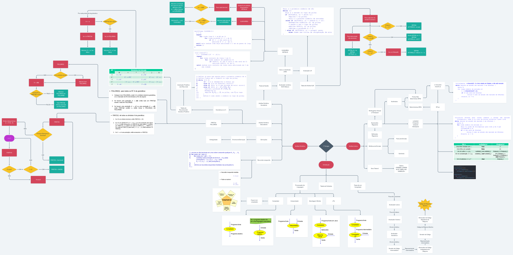

# Resumo primeiro estágio

Fluxograma dos assuntos abordados no primeiro estágio. Contém fluxogramas para facilitar o entendimento do funcionamento de alguns algortimos abordados nesse estágio:

Foi utilizado o [Whimsical](http://whimsical.com) para criar o fluxograma/imagem.
