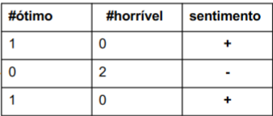

# NLP em uma página

# Fundamentos

## O que é Aprendizagem de Máquina

> A computer program is said to learn from experience Ewith respect to some task Tand some performance measure P, if its performance on T, as measured by P, improves with experience E.” – Tom Mitchell, 1997
> 

### AM Supervisionada

- Dados rotulados com a resposta “certa”
- É possível fazer:
    - Regressão, quando a variável alvo é numérica
    - Classificação, quando a variável alvo é categórica

### AM Não Supervisionada

- Utilizada para descobrir padrões interessantes nos dados, através de agrupamentos (clusters)

## Processamento de Linguagem Natural

Processamento de linguagem natural é uma área de pesquisa em Ciência da Computação e IA preocupada com o processamento de linguagens naturais como Português, Inglês e Mandarim.

## Lei de Zipf

- poucas palavras ocorrem com muita frequência enquanto muitas palavras ocorrem raramente
- O rank (r) de uma palavra vezes sua frequência (f) é aproximadamente uma constante (k).

### Qual a proporção de palavras com uma dada frequência?

- Uma palavra que ocorre n vezes tem rank r(n)= k/n
- Então, proporção com frequência n é 1/n(n+1).

---

## Técnicas de Pré-Processamentos

Para trabalhar com textos, é necessário um pré-processamento para colocá-lo em um formato adequado, algumas das técnicas são:

- Tokenização
    
    Quebra o texto em tokens, que podem ser palavras, frases ou caracteres.
    
    Porém, muita informação pode ser perdida: palavras pequenas, com hifens, siglas e contexto.
    

- Lematização
    
    Técnica de processamento de texto que transforma substantivos no plural para o singular e conjugações e variações verbais para o infinitivo
    

- Stop Words
    
    Stopwords são normalmente as palavras mais frequentes em uma coleção de documentos textuais e que sozinhas carregam pouco sentido.
    

- Stemming
    
    Stemmers tentam reduzir variações morfológicas à um mesmo radical.
    
    Ex: Casa, Casinha e Casão. Resultado: Cas.
    
- N-gramas
    
    Utilizadas para reconhecer frases: frase é qualquer sequência de **n** palavras.
    
    N-gramas frequentes são mais provaveis de serem palavras com significado.
    

## Modelo Vetorial

Um vocabulário é representado em forma de vetor e é possível analisar a assimilabilidade através de quão próximo de um vetor determinado documento se encontra.

- Modelo Binário (Bag of Words)
    - 1: se a palavra está presente; 0: caso o contrario.
    - Cada documento é representado por um vetor, e todos tem o mesmo o tamanho.
    - A maior limitação do modelo binário é que ele provê os mesmos pesos palavras independente das frequências de ocorrência.

- Modelo Termo Frequente(TF)
    - 𝑡𝑓(𝑤i): Contagem da palavra 𝑤i no documento ⃗𝑑.
    - Atribuir o mesmo valor para todos os termos pode ocultar a importância do termo no documento.
    - Mas, podemos dar peso muito grande stopwords e por isso, dois documentos podem ser considerados altamente similares somente porque eles usam as mesmas stopwords.

- Modelo TF-IDF
    - Inverse Document Frequency
    - Foi feito para penalizar palavras muito frequentes em diversos documentos.
    - IDF(w) = log[ (M+1)/k ]
        - M: Docs na coleção e
        - K: docs contendo w

# Aprendizagem Não Supervisionada

## Agrupamento

Um dos padrões importantes que percebemos e usamos para entender/descrever dados é o de *subconjuntos dos dados com alta semelhança* entre si. No jargão que usaremos aqui, **grupos de dados** semelhantes entre si.

Algoritmos de agrupamento servem principalmente para ajudar um analista a reduzir um conjunto de dados a um conjunto menor de grupos. Isso facilita compreensão e comunicação.

## Encontrando agrupamentos

Uma forma de descrever estrutura nos dados é percebendo grupos de observações mais semelhantes entre si que com o restante dos dados.

O tipo de pergunta que queremos responder com agrupamento é *existem grupos de dados claramente diferentes em termos de var_1, var_2... e var_n?*

### Sempre há grupos?

Não.

## Utilizando k-means

Ele encontra k grupos, baseado na variável n_clusters.

<aside>
💡 Encontrar esses grupos, seria humanamente impossíveis, então os algoritmos de agrupamento procuram um bom ponto de divisão mas não é necessariamente o ideal.

</aside>

```python
from sklearn.cluster import KMeans

kmeans = KMeans(n_clusters=4)
kmeans.fit(df_ex)
grupo = kmeans.predict(df_ex)

df_agrupado = df_ex.assign(grupo = grupo)

df_agrupado
```

O algoritmo é conceitualmente bem simples; é uma iteração com duas fases: dado um conjunto de *k* centros de grupos

1. atribui cada ponto ao grupo cujo centro está mais
 próximo, e 
2. move os centros para o meio dos pontos que compõem seu 
grupo.

## Escolhendo o k no k-means

- Quão longe meu ponto está do centro do cluster?
    
    Uma medida de heterogeneidade dos grupos é o SSD:
    
    <aside>
    📏 SSD = ∑(*xi*−*ci*)^2
    
    </aside>
    

### O método do cotovelo

O método mais comum é usar uma métrica de heterogeneidade dentro dos clusters. Com uma métrica desse tipo, uma solução com k maior sempre será mais homogênea. O método então consiste de examinar vários valores de *k* e *escolher um valor a partir do qual a heterogeneidade para de mudar consideravelmente*.

```python
qualidade = pd.DataFrame(columns = ['k', 'ssd'])
for k in range(1,10):
  kmeans = KMeans(n_clusters=k, n_init=20)
  kmeans.fit(df)
  qualidade = qualidade.append({'k': k, 'ssd' : kmeans.inertia_}, ignore_index=True)
```

**E quando não há estrutura de grupos?**

Quanto menos estrutura, menos o joelho ficará aparente.

# Modelagem de Tópicos com LDA

Quando descrevemos textos, frequentemente o fazemos usando além das palavras do texto também quais são os assuntos ou **tópicos** de que um texto trata. **LDA descobre grupos de palavras que são utilizadas em conjunto e aproxima esses tópicos.**

LDA funciona baseado em frequências de palavras, então usaremos TFs, e não TF-IDFs.

LDA tem como objetivo entregar as distribuições:

- da probabilidade de tópicos em um documento
- a probabilidade de palavras dentro de um tópico

## Encontrando tópicos

O resultado terá

- uma matriz que descreve a relação entre palavras e tópicos
- uma matriz que descreve a relação entre documentos e tópicos

```python
lda = LatentDirichletAllocation(n_components=15, 
                                learning_method='online', # 'online' equivale a minibatch no k-means
                                random_state=0)
lda.fit(vec_text)
doc_topic_matrix = lda.transform(vec_text)
```

# Aprendizagem Supervisionada

## Regressão Logística

É a rede neural mais simples que pode ser encontrada na computação, utilizando variáveis numéricas seguindo o seguinte formato:



A coluna sentimento, é o equivalente ao label dessa linha. Importante para modelos supervisionados.

$$
𝑆𝑐𝑜𝑟𝑒 (𝒙) = 1.0 ∗ 𝑥’− 1.5 ∗ 𝑥”
$$

O principio é da regressão logística é achar uma função que melhor descreva o comportamento dos dados e possa separá-los linearmente.

Função de custo: calcula quão longe os pontos estão da reta traçada pela minha função.