# RESUMO PROGRAMAÇÃO CONCORRENTE - PARTE 2

**LINKS ÚTEIS E MATERIAIS EXTRA**

*Alguns desses materiais estão dispostos durante este resumo para consulta complementar.*

**BARREIRAS**

[Barreiras](http://www.lac.inpe.br/~celso/cap334/aula8/aula8d/tsld016.htm)

[Barrier Synchronization - Georgia Tech - Advanced Operating Systems](https://www.youtube.com/watch?v=fCFndi19yNs)

**WRITE BACK**

[Write Back Cache Example - Georgia Tech HPCA Part 3](https://www.youtube.com/watch?v=xU0ICkgTLTo)

**TRAVA DE ANDERSON (TRAVAS BASEADAS EM ARRAY)**

[Array Based Queueing Lock - Georgia Tech - Advanced Operating Systems](https://www.youtube.com/watch?v=yKsH-QGtXPU)

[Array Based Queueing Lock (cont) - Georgia Tech - Advanced Operating Systems](https://www.youtube.com/watch?v=W6rrkR2v2G8)

[Array Based Queueing Lock (cont) - Georgia Tech - Advanced Operating Systems](https://www.youtube.com/watch?v=ur9vyAbYb2Q)

**TRAVA CLH**

[Computação concorrente, cap. 7, parte 7: Spin locks (CLH locks)](https://www.youtube.com/watch?v=t0SflcbE6WA)

**TRAVA MCS**

[Link Based Queueing Lock - Georgia Tech - Advanced Operating Systems](https://www.youtube.com/watch?v=R-xJmv2cp5Q)

[Link Based Queueing Lock (cont) - Georgia Tech - Advanced Operating Systems](https://www.youtube.com/watch?v=SJ3Ys9n2dgM)

[Link Based Queueing Lock (cont) - Georgia Tech - Advanced Operating Systems](https://www.youtube.com/watch?v=o87PPY3MSvg)

[Link Based Queueing Lock (cont) - Georgia Tech - Advanced Operating Systems](https://www.youtube.com/watch?v=SXUJ40PtcRo)

[Link Based Queueing Lock (cont) - Georgia Tech - Advanced Operating Systems](https://www.youtube.com/watch?v=Da5xO_eQ-Qg)

[Link Based Queueing Lock (cont) - Georgia Tech - Advanced Operating Systems](https://www.youtube.com/watch?v=P3dFwI_wQpc)

[Computação concorrente, cap. 7, parte 8: Spin locks (MCS locks)](https://www.youtube.com/watch?v=7J6RfQcIoF8&t=1s)

**MODELOS DE CONSISTÊNCIA** 

[[FSPD] 12b: modelos de consistência centrados nos dados](https://www.youtube.com/watch?v=xal3WOz3b2k)

**TIPOS DE SINCRONIZAÇÃO**

[Computação concorrente, cap. 9, parte 1: sincronização grossa e fina (coarse/fine grained sync)](https://www.youtube.com/watch?v=5go096Rzi40&list=PLRI_8pjQtk5Q03TTNhpZuGpeIbuBQmt3f&index=15)

[Computação conc., cap. 9, parte 2: sincr. otimista (optimistic sync) e sincr. preguiçosa (lazy sync)](https://www.youtube.com/watch?v=DydGnF5mzqQ&list=PLRI_8pjQtk5Q03TTNhpZuGpeIbuBQmt3f&index=16)

[Computação concorrente, cap. 9, parte 3: soluções não-bloqueantes](https://www.youtube.com/watch?v=Ra4UZQQoMfM&list=PLRI_8pjQtk5Q03TTNhpZuGpeIbuBQmt3f&index=17)

# Barreiras

**DEFINIÇÃO**

Uma barreira é um **método de sincronização** no qual nenhuma thread pode ir adiante na sua execução até que **todas** as demais **tenham atingido um determinado ponto de execução**. 

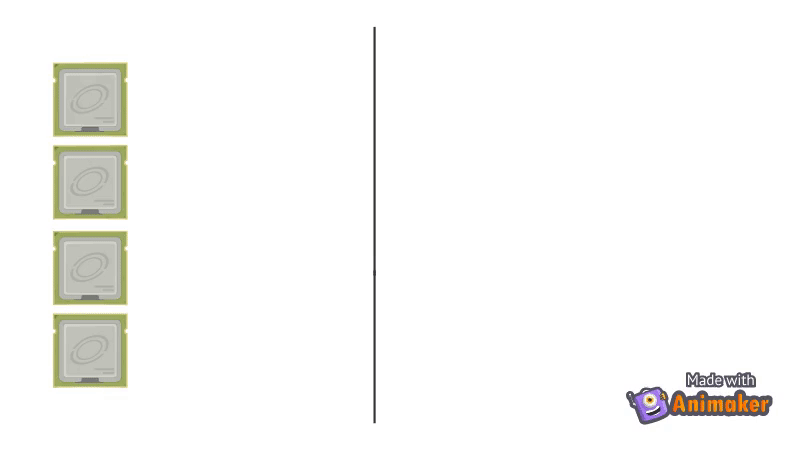

**UTILIDADE** 

Barreiras são implementações úteis de sincronização quando o contexto exige **sincronização coletiva**, isto é, que todas as threas tenham atingido um determinado ponto para que possam seguir adiante.

**IMPLEMENTAÇÃO**

Barreiras são implementadas com **dois spinlocks**: um primeiro para proteger o contator de chegadas à barreira e o outro que indica que todas as threads atingiram o ponto de sincronização e podem seguir.  ****O primeiro spinlock pode ser evitado se a implementação utilizar operações atômicas para decrementar o contador.

<aside>
⚠️ **NÃO CONFUNDIR**

Barreiras (*barriers*) não são o mesmo que “cercas” (*fences*)*.* Barreiras estão melhor relacionadas com sincronização de execução, enquanto *fences* estão relacionadas à consistência de memória.

</aside>

## **ESTUDO DE CASO**

<aside>
💡 Considere o problema de **renderização de um vídeo**, no qual o domínio é subdividido em tarefas que compreendem preparar e mostrar um frame.

</aside>

### **MÚLTIPLAS THREADS TRABALHANDO NO PROBLEMA**

```java
int threadID = TreadID.get()

while (true) {
	frame[treadID].prepare();
	frame[treadID].display();
} 
```

**QUAL O PROBLEMA DESSA SOLUÇÃO?** 

Algumas threads podem ser mais lentas que outras por uma porção de motivos, como a dificuldade/complexidade de processamento de um frame ou a perda do processador por parte dessa thread (um cenário em que o número de threads é maior que o número de processadores disponíveis), fatores que podem diminuir o desempenho de tempo desses fluxos de execução.

Desse modo, podemos ter threads que renderizem frames mais rapidamente que outras e isso poderá atrasar a resolução do problema.

### UMA PREPARA, OUTRA EXIBE

Podemos também pensar em uma simplificação binária, na qual enquanto uma thread prepara um frame, a outra exibe e assim por diante. Essa implementação pode ser realizada via uma flag:

```java
while (true) {
	if (turn) {
		frame[0].display();
	} else {
		frame[1].display();
	}
	
	turn = !turn
}
```

```java
while (true) {
	if (turn) {
		frame[1].prepare();
	} else {
		frame[0].prepare();	
	}

	turn = !turn
}
```

Mas como iremos garantir sincronia nesses casos?

### UTILIZAR UMA SOLUÇÃO COM BARREIRAS

```java
private Barrier barrier

while (true) {
	frame[threadID].prepare();
	barrier.await() // Espera que todas as threads atinjam esse ponto
	frame[threadID].display();
	barrier.await() // Novamente aguarda todas as threads atingirem esse ponto
}
```

No exemplo acima há um uso simplificado de uma barreira para realizar o preparo e a exibição dos frames, no qual todas as threads sincronizam após finalizarem a preparação e em seguida continuam suas execuções mostrando o conteúdo, sincronizando novamente após isso e assim por diante. Mas, como são implementadas essas barreiras?

## Implementando Barreiras

**BARREIRAS COM VARIÁVEIS ATÔMICAS E CONTADORES**

Uma **barreira com contador** é implementada de modo que um **contador** é inicializado no início do bloco de sincronização com **a quantidade de threads** que se deseja sincronizar pela barreira. 

A cada thread que atinge o ponto de sincronização, um **decremento atômico** é realizado do contador, até que este seja zerado.

Se a thread que decrementou **não zerou** o contador, isso significa que existe alguma thread que ainda **não atingiu a barreira**, portanto esta ficará em **spin (espera ocupada)** até que todas as threads **sincronizem no ponto desejado** e possam seguir suas execuções.

.gif)

[→ VÍDEO RESUMIDO SOBRE BARREIRAS](https://www.notion.so/assets_resumo_2-575677e675fe4395bcf951990f26360e) 

# Implementação de componentes concorrentes

Quando estamos implementando uma solução concorrente, devemos estar cientes de que existem alguns **compromissos** e **critérios de corretude** a depender do problema. 

## Spinlocks e contenção

**TROCA DE CONTEXTO (*BLOCK*) OU ESPERA OCUPADA (*SPIN*)?**

Como dito anteriormente, a depender do contexto pode ser mais eficiente escolher uma ou outra estratégia para realização da sincronização. Mas, qual é melhor diante do contexto?

**ESPERA OCUPADA (SPIN)**

A espera ocupada pode ser eficiente se o contexto apresenta **regiões críticas pequenas**. Isso se apresenta pelo fato de que realizar o spin é, em outras palavras, “esquentar” a CPU com uma atividade que não é útil no contexto, mantendo o processador ocupado e não utilizável por outros processos nesse período. Em caso de aplicado a regiões críticas longas, a espera ocupada pode atrasar a execução de outras tarefas, por não haver liberação do uso dos recursos durante aquele espaço de tempo. Já em contextos com regiões críticas pequenas, vale mais manter uma espera do que realizar uma troca de contexto com operações em memória, que são bastante custosas do ponto de vista operacional. 

**TROCA DE CONTEXTO (BLOCK)**

A troca de contexto muitas vezes se mostra custosa pela sua necessidade de ler e escrever da memória (operações de alto custo). Porém, em se tratando de **regiões críticas longas**, troca de contexto pode ser menos custosa do que manter uma espera ocupada por tempo considerável. Já em contextos contrários, realizar block em regiões críticas muito curtas pode se mostrar bastante custoso, tendo em vista a grande quantidade de operações em memória que seriam requeridas em um pequeno espaço de tempo. 

Em sistemas **uniprocessados**, essa é a única forma de sincronização que faz algum sentido, dado que manter uma espera ocupada iria tomar toda a capacidade de processamento do mesmo. 

**TRAVANDO COM OPERAÇÕES ATÔMICAS**

Uma **operação atômica** realiza toda a sua execução de maneira **indivisível**, isto é, não é possível haver região crítica durante a execução de sua operação. Essas operações são implementadas em um nível de software muito mais baixo, bem próximo ao processador, por meio de instruções (como a famosa **Test And Set**). 

O benefício de utilizar um método de sincronização implementado por uma operação atômica é que existe **simplicidade** e **ocupa pouca memória**, podendo utilizar de apenas uma região para uma implementação que exige a sincronia de N threads. 

Porém, quando o contexto exige muitos travamentos e destravamentos, o tempo para a execução do algoritmo **não se mantém constante**, mas sim praticamente exponencial, isto é, quanto mais threads se têm para sincronizar, menos eficiente é utilizar uma operação atômica para tal.  

Esse ganho de complexidade está muito relacionado ao meio físico do sistema computacional, pois barramentos podem ser sobrecarregados com acessos à memória e aumentar a complexidade do método. Como podemos contornar esse tipo de problema?

**ARQUITETURAS BASEADA EM BARRAMENTOS**

Quando estamos tratando de máquinas pequenas, vários processadores acessam a memória através do mesmo barramento.

Muitos acessos à memória podem ocasionar sobrecarca dos barramentos desse sistema computacional.

Uma das formas de contornar esse tipo de ocorrência é aproximando o dado para uma memória de mais fácil acesso. Uma opção trivial é utilizar memórias cache.

Cada processador pode ter um **cache local** que prioriza os acessos dos dados ali armazenados.

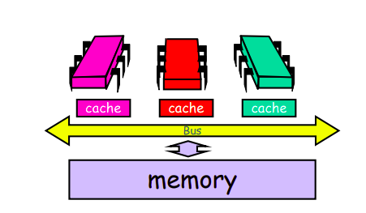

Desse modo, ao invés de sempre buscar na memória mais distante, cada processador pode buscar o dado desejado em sua memória próxima. Assim, existe uma diminuição do fluxo de dados no barramento compartilhado entre essas entidades. 

Além disso, outros processadores podem observar dados dos caches locais de outros e diminuir o fluxo no barramento principal quando se tenta buscar o dado da memória mais distante. Porém, algumas medidas devem ser tomadas relativas à inconsistência de dados, dado que, como cada processador pode alterar o seu dado de cache local, um outro processador pode observar um dado inconsistente com o da memória. Para isso, podemos adotar algumas estratégias, sendo a mais utilizada o **write back**.

**WRITE BACK**

O write back é uma estratégia de escrita e leitura em cache que leva em consideração medidas para manter a consistência de um dado. Nessa alternativa, podemos considerar que um dado pode assumir três estados:

→ VÁLIDO: quando está em concordância com o que foi lido da memória

→ INVÁLIDO: quando a cópia em cache está inconsistente (houve uma mudança no dado da memória)

→ SUJO: quando a cópia tem valor alterado

Nesse caso, só é necessário escrever o dado na memória quando houver a leitura de um dado em cache que foi sujo, isto é, localmente alterado.

.gif)

[→ VÍDEO RESUMIDO SOBRE WRITE BACK](https://www.notion.so/assets_resumo_2-575677e675fe4395bcf951990f26360e)

**WRITE BACK RESOLVE O GARGALO DO TEST AND SET?**

Mesmo com a aplicação dessa estratégia, o Test And Set (TAS) continua proporcionando um grande overhead, pois essa operação atômica indica o dado como sujo sempre que é chamada, fazendo com que haja uma grande demanda de leitura e escrita na memória mais distante, proporcionando uma sobrecarga dos barramentos compartilhados. 

No TTAS há uma melhoria desse resultado, dado que se evita ao máximo realizar um TAS direto, de maneira que os dados serão lidos do cache até que um deles esteja marcado como inválido. 

Em um sistema operando em multithreds, a thread que primeiro entra na região crítica lê o dado de maneira atualizada, e as demais passam a ler desse cache, descongestionando o barramento compartilhado. Quando essa thread sai da região crítica, ela invalida o dado e acorda as demais threads, que tentam realizar um TAS, mas apenas uma consegue (por ser uma operação atômica), fazendo com que ela tome a região crítica e o processo se repita. 

# Implementando Spinlocks

Até o momento, o problema que estamos tentando resolver com as soluções propostas é a **contenção**. 

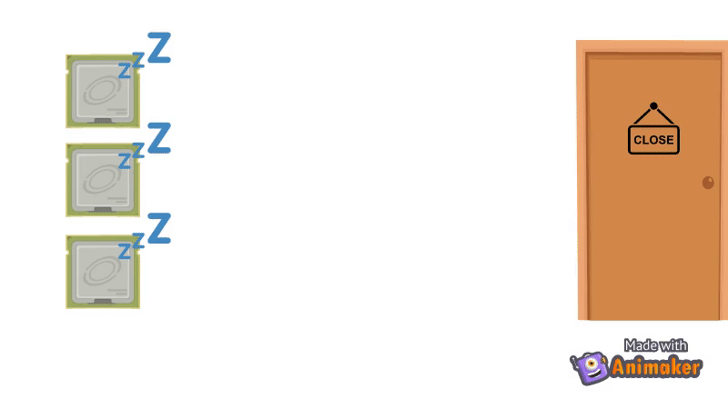

<aside>
🔄 **RELEMBRANDO**

A contenção ocorre quando temos um grande hotspot na concorrência e todas as threads tentam acessar esse ponto ao mesmo tempo, ocasionando uma perda do desempenho dada esta disputa.

</aside>

Além disso, como visto nos casos acima estudados, algumas vezes limitações, contexto e outras situações são tão importantes quanto simplesmente o funcionamento e a implementação de uma trava.

## Trava de Anderson

A **trava de Anderson** pode ser compreendida como uma fila de threads. Esse algoritmo para implementação de spinlock utiliza a estratégia FIFO para realizar espera ocupada em um sistema multithreads quando há a tentativa de ganhar a região crítica. 

A implementação é feita com base em um array e utiliza de operações atômicas para incrementar o índice de acesso da posição que uma thread está fazendo spin.

Nessa abordagem, cada thread faz spin em sua própria variável enquanto essa assume *false* como valor. Quando a posição da variável da thread está como *true*, isso significa dizer que esta thread está de posse da trava da região, isto é, quando a thread atual deixar a região crítica, ela poderá entrar, dado que é sua vez, enquanto as demais estão fazendo spin. Quando uma thread está na região crítica, ela passa a posse da trava para a variável seguinte (seguindo o esquema de FIFO).

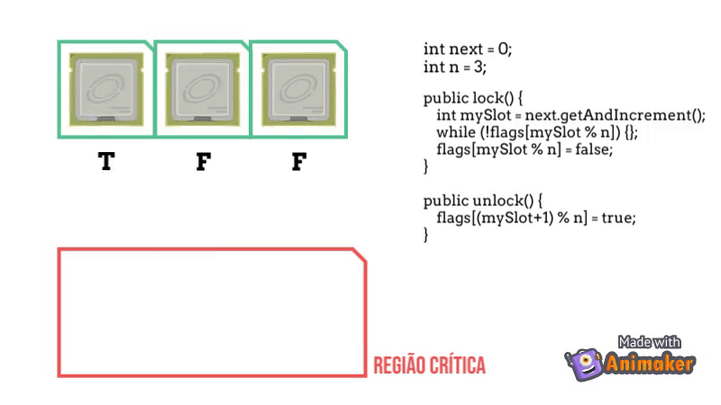

**PONTOS POSITIVOS DA TRAVA DE ANDERSON**

- **Uso de uma operação atômica para incremento do índice que irá ganhar a trava**
    
    Como já é sabido, **operações atômicas não são bloqueantes**, portanto, ao utilizá-la na implementação dessa trava para realizar o incremento da flag, evitamos de gerar uma região crítica dentro da própria trava. Além disso, operações atômicas são pouco custosas para nosso contexto.
    
- **O processo para entrada na região crítica é sequenciado por meio de uma fila**
    
    Sequenciar a entrada na região crítica evita a ocorrência de um grande overhead, de deadlock e de starvation das threads que concorrem por ela, dado que, garantindo que a thread deixe a região (faça unlock), todas as threads irão poder ganhar a região crítica no seu momento. 
    
- **Cada thread faz spin em uma variável privada**
    
    Não há concorrência das variáveis que atuam como flag, dado que toda thread atua na sua própria variável privada. 
    
- **Implementado em uma fila circular**
    
    O acesso nessa estrutura de dados é realizado em O(n) e há uma representação de infinitude, dado que é circular. 
    

**PONTOS FALTANTES DA TRAVA DE ANDERSON**

- **Número de posições tem que ser proporcional ao número de threads**
    
    Para que o algoritmo tenha um bom funcionamento, o número de posições da fila tem que ser proporcional ao número de threads operantes no sistema, tendo que este valor deve ser previamente conhecido, mas se trata de uma informação geralmente conhecida dada a arquitetura do sistema computacional. 
    

[→ VÍDEO RESUMIDO SOBRE TRAVA DE ANDERSON](https://www.notion.so/assets_resumo_2-575677e675fe4395bcf951990f26360e)

## Trava CLH

A trava CLH também opera em um esquema de fila de prioridade, porém com o uso de uma lista encadeada, ao invés de um array, como na trava de Anderson.

Nessa abordagem, a calda da lista aponta inicialmente sempre para um nó falso, indicando que a região crítica está liberada. Com a chegada de uma thread interessada em ocupar a região crítica, esta cria um nó verdadeiro, que será agora apontado pela calda da fila, e também cria um apontador para nó falso inicialmente apontado pela calda. 

No momento do unlock() essa thread muda a sua flag para falso, de modo que, se existe outra flag na fila, essa irá observar que a região crítica foi liberada, e faz um swap dela com o predecessor (a thread sai da fila).

A lógica por trás disso é que cada thread é capaz de observar qual o estado da thread predecessora a ela, com um apontador para sua flag. Se esta flag está como verdadeira, existem dois cenários possíveis: a thread está na região crítica, ou a thread tem prioridade em ganhar a região crítica. Se a flag estiver como falsa, isso indica que a posse da trava é da thread atual. 

A lista encadeada criada pela CLH é indireta, isto é, ela é compreendida pelo fato de cada thread apontar para dois endereços de flag, mas isso não é feito de maneira explícita (como em uma implementação de linkedlist convencional, onde temos nós com apontadores diretos uns para os outros).

Além disso, é válido salientar que uma thread faz spin sempre em seu cache local, o que faz com que essa solução seja mais eficiente do ponto de vista de acesso à memória. Porém, esse mesmo fator faz com que, em algumas arquiteturas que não possuem sistema de cache local, como a NANO, essa estratégia passe a ser bem mais custosa, dado que o acesso terá que ser realizado em uma memória local de um outro processador.


## Trava MCS

A implementação de spinlock por MCS é uma melhoria das anteriores, resolvendo o problema visto na CLH. 

De mesmo modo, utiliza de uma lista encadeada para implementar uma fila de prioridade, porém, desta vez, de maneira explícita. 

A calda da lista inicia apontando para um nó NIL, indicando que não há thread ocupando a região crítica. Quando uma thread chega interessada em ocupar a região crítica, a calda aponta para este nó, que apontará para o nó NIL. Desse modo, essa thread poderá ganhar a região. 

Caso uma thread chegue em seguida, a calda também apontará para o nó de interesse dela, que apontará para o nó de interesse da thread que chegou anteriormente. Quando a thread da região crítica faz unlock, esta envia um sinal para a thread que está esperando por ela, fazendo com que o apontador mude para NIL, entregando a posse da trava para ela. 

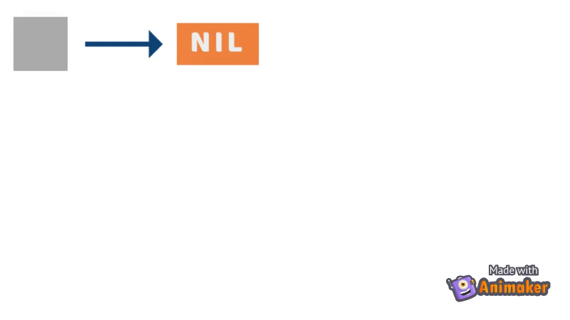

# Objetos concorrentes

Quando estamos interessados em implementar estruturas de dados e objetos que necessitam de concorrência, temos que levar em consideração alguns cuidados. 

Assim como estamos interessados em manter algumas propriedades anteriormente faladas, como corretude e progresso, além de evitar contenção, estamos ainda preocupados com a garantia de **corretude**.

Porém, dependendo do contexto, o conceito de corretude pode ultrapassar o funcionamento esperado da estrutura de dados. Por exemplo, algumas vezes estamos mais preocupados com o desempenho do que com a atualização dos dados, e por isso podemos abrir mão da segunda, tomando como base um SGBD. Para alguns sistemas, o dado atualizado é bastante importante (como em sistemas bancários, por exemplo, o que faz com que esses tenham que abrir mão de alto desempenho), mas em outros isso é passável, sendo aceitável a recuperação de dados mais antigos.

Para isso, podemos flexibilizar o conceito de corretude, fazendo com que os objetos possam ter diferentes tipos de **consistência**. 

## Modelos de consistência

Modelos de consistência são necessários, pois muitas vezes necessitamos de haver replicação para o ganho de desempenho. Desse modo, queremos ter algumas garantias de como as partes de um sistema concorrente irão observar as operações para **garantir a corretude de funcionamento do contexto**. 

Como já falado anteriormente, para alguns dados contextos podemos abrir mão, ou melhor, flexibilizar a ideia de corretude para ganharmos em desempenho, já em outros, é necessário deixar o desempenho como uma menor prioridade para garantir a corretude do que o objeto se propõe. 

### Consistência estrita, atômica ou linearizabilidade

A consistência estrita está vinculada ao **tempo** global do sistema, de modo que todos os eventos acontecem para todas as partes na ordem e no tempo que estão determinados na sequência.

O nível de restrição dessa solução é bastante alto, pois todos os eventos se colocam praticamente de maneira sequencial. 

### Consistência sequencial

Na consistência sequencial podemos dizer que o efeito de cada execução nas partes concorrentes é o mesmo que seria obtido para todas as leituras e escritas se essas fossem executadas em uma ordem sequencial, sem inversões dentro de cada programa. 

<aside>
💡 É possível **descrever uma sequencia de eventos** que é válida para a execução de todas as threads, isto é, todas as threads envolvidas **percebem a mesma ordem dos eventos** para uma dada execução.

</aside>

**EXEMPLO 1 - TEM CONSISTÊNCIA SEQUENCIAL**

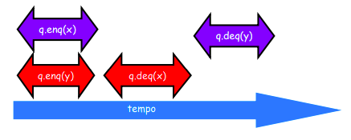

q.enq(x), q.enq(y), q.deq(x), q.deq(y) ✅

**EXEMPLO 2 - TEM CONSISTÊNCIA SEQUENCIAL**

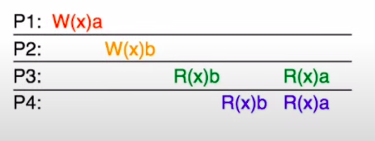

p2.write(b), p3.read(b), p4.read(b), p1.write(a), p3.read(a), p4.read(a) ✅

**EXEMPLO 3 - NÃO TEM CONSISTENCIA SEQUENCIAL**

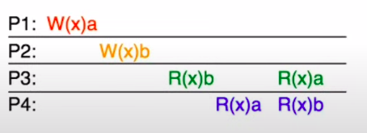

p1.write(a), p4.read(a) … ❌

p2.write(b), p3.read(b) … ❌

A consistência sequencial é mais flexível do que a consistência estrita, mas ainda mantém um alto nível de inflexibilidade. Isso se dá ao fato de que, mesmo que ela não necessite de restrição temporal, há a exigencia de que **todas as threads sejam necessariamente executadas em concordancia com a mesma sequencia de eventos**. 

### Consistência causal

Na consistência causal, apenas os eventos que apresentam **correlação de causa e efeito** devem ser vistos na **mesma ordem por todas as threads**.

Podemos interpretar como uma relação de causa e efeito, por exemplo, a leitura e a escrita de um valor na memória: para que eu possa ler o valor A, necessariamente tenho que ter escrito por último o valor A na memória. 

**EXEMPLO 1**

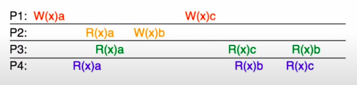

**p1.write(a), p2.read(a), p3.read(a), p4.read(a)** ✅

Perceba que, necessariamente, o valor **a** tinha que estar escrito na memória para que os processos **P2**, **P3** e **P4** possam ser executados com consistência. Já para as demais escritas, isso pouco importa: a escrita de P1 do valor c e a escrita de P2 do valor b são concorrentes e podem acontecer e serem percebidas de maneiras diferentes pelos processos P3 e P4.

**p1.write(a), p2.read(a), p3.read(a), p4.read(a)**, ****p1.write(c), p3.write(c), p2.write(b), p3.read(b) ✅ //P3 percebeu essa ordem

**p1.write(a), p2.read(a), p3.read(a), p4.read(a)**, p2.write(b), p4.read(b), p1.write(c), p4.read(c) ✅ //P4 percebeu essa ordem

**EXEMPLO 2**

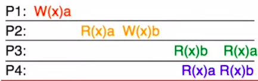

p1.write(a), p2.read(a), p3.read(a) … ❌

Para garantir a consistência causal é necessário que todas as relações de causalidade sejam garantidas. No exemplo acima temos uma contradição nesse sentido:

Em P3, para que possamos R(x)a, é necessário que tenhamos R(x)b. Para tal, é necessário que, em P2, W(x)b tenha sido realizado, mas para isso R(x)a tem que ter sido feito anteriormente. Para que R(X)a tenha sido feito em P2, W(x)a tem que ter sido realizado em P1. Porém, perceba que nessa ordem de causalidade é necessário que x tenha sido em algum momento sobrescrito, fazendo com que seja impossível garantir que P3 aconteça, dada a causalidade. 

**EXEMPLO 3**

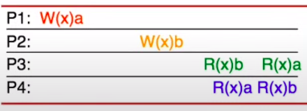

p1.write(a), p4.read(a), p2.write(b), p4.read(b) ✅

p2.write(b), p3.read(b), p1.write(a), p3.read(a) ✅

Perceba que as escritas de P1 e P2 são totalmente concorrentes e podem ser percebidas de maneiras distintas pelos processos P3 e P4.

**EXEMPLO 4**


p1.write_x(a), p2.read_x(a), p2.write_y(b) ✅

E se…

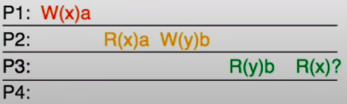

Qual pode ser o valor lido em R(x)❓ ?

p1.write_x(a), p2.read_x(a), p3.read_y(b), p3.read_x(a) ✅

❓ = a

Trivial! Mas, e se…

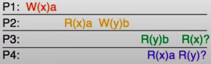

p1.write_x(a), p2.read_x(a), p2.write_y(b), p3.read_y(b), p4.read_x(a), p4.read_y(b), p3.read_x(a) ✅

R(x)❓ = a

R(y)❓ = b

Essa sequencia é válida e pode acontecer, mas existe um outro cenário! P2 e P4 não mantém relação causal, isto é, a leitura de R(y)? em P4 pode ter acontecido antes da escrita de W(y)b, fazendo com que o resultado da leitura possa ser:

R(x)❓ = a

R(y)❓ = NIL

### Consistência quiescente ou eventual

Na consistência eventual, há a garantia apenas de que, em algum momento, as operações serão realizadas e as alterações serão visíveis para todas as threads. 

Um exemplo de consistência quiescente na prática são os sistemas web e também o DNS: os dados alterados são propagados de maneira não imediata, mas de maneira que em algum momento todos os interessados irão perceber as modificações realizadas.

## Como escolher o modelo de consistência?

| MODELO | CARACTERÍTICAS | APLICABILIDADE |
| --- | --- | --- |
| CONSISTÊNCIA ATÔMICA | É de fácil compreensão; a ordem temporal em diferentes threads é de extrema importância; não exige bloqueio, dado que uma operação acontece sempre após outra.  | Objetos que serão utilizados como blocos ou que necessitam de ordem temporal de operação e atualização. |
| CONSISTÊNCIA SEQUENCIAL | Não leva a ordem temporal em consideração, o que implica que a ordem de execução pode ser alterada entre threads; não exige bloqueio, dado que considera-se uma sequência de operações. | Objetos são independentes, isto é, quando as leituras e escritas podem ser reordenadas entre as threads. |
| CONSISTÊNCIA CAUSAL | Necessita de amarra apenas em operações que envolvem causa e efeito; não exige bloqueio, dado que, mantendo as relações de causa e efeito, as demais podem ser interpretados de maneiras diferentes pelas demais threads. | Otimizações de sistemas distribuídos. |
| CONSISTÊNCIA QUIESCENTE | Dado o contexto, existe uma garantia de que em algum momento, todas as threads irão observar as operações realizadas. | Sistemas web, de compartilhamento de arquivos e propagação de DNS. |

## Corretude e progresso na prática

Derivado de assuntos anteriormente discutidos, podemos retomar que aumentar o **número de processadores** **não** vai necessariamente **aumentar a eficiência do sistema** de maneira direta, dado que **sempre há uma parte sequencial escondida** que poderá ocasionar um gargalo futuro no objeto (derivado da **Lei de Amdahl**).

### Sincronização grossa

A sincronização grossa diz respeito ao que já estamos acostumados a perceber em exemplos já vistos de sincronização:

```java
lock();
criticalAreaCode();
unlock();
```

Ou seja, há o **travamento** da região crítica (ou a tentativa de fazê-lo) antes de adentrar a mesma e o **destravamento** na saída. 

Sabemos que esse princípio **garante corretude**, pois a exclusão mútua aplicada nessas técnicas impede que outras threads possam executar o bloco de código ao mesmo tempo. 

Porém, a sincronização grossa pode ocasionar **gargalos**, pois as threads que tentam realizar o lock() da região ficarão em **espera** (ou perdem o processador, no caso de um block) até que a atual faça unlock(), reduzindo em parte a eficiência do sistema. 

**EXEMPLO DO HASHMAP**

Podemos imaginar a ED de um HashMap. Sabemos que ele seque um esquema de tabela hash, na qual uma chave aponta para uma coleção de elementos, como no exemplo abaixo:

| KEY | 0 | 1 | 2 | … | n |
| --- | --- | --- | --- | --- | --- |
| KEY 1 |  |  |  | … |  |
| KEY 2 |  |  |  | … |  |
| KEY 3 |  |  |  | … |  |

Utilizando sincronização grossa, para adicionar um elemento a esse HashMap, ele por inteiro seria travado para que uma chave fosse acessada e um elemento fosse escrito na coleção apontada por essa chave. Essa decisão irá provocar a espera de outras threads que estão acessando essa ED não necessariamente no mesmo apontador.

**lock()**

| KEY | 0 | 1 | 2 | … | n |
| --- | --- | --- | --- | --- | --- |
| KEY 1 |  |  |  | … |  |
| KEY 2 |  |  |  | … |  |
| KEY 3 |  |  |  | … |  |

**unlock()**

### Sincronização granular

Na sincronização granular, ao invés de realizar um lock() na estrutura completa, este é realizado em partes da estrutura. Desse modo, pensando em objetos concorrentes, a parte da estrutura de dados que será manipulada será travada, enquanto as demais ficarão livres para acesso.

**RETOMANDO O EXEMPLO DO HASHMAP**

Ainda observando o exemplo do HashMap: se ao invés de realizarmos um lock() em toda a ED, resolvermos fazê-lo em uma porção menor, neste caso, para cada chave que é acessada para uma operação de escrita, apenas ela é travada, deixando as demais livres para serem acessadas.

**lock(KEY 2)**

| KEY | 0 | 1 | 2 | … | n |
| --- | --- | --- | --- | --- | --- |
| KEY 1 |  |  |  | … |  |
| KEY 2 |  |  |  | … |  |
| KEY 3 |  |  |  | … |  |

**unlock(KEY 2)**

### Sincronização otimista

Na sincronização otimista, as operações de alteração em uma região da estrutura de dados é realizada sem haver o travamento da região durante a execução da operação. Isso pode ser realizado por meio de uma verificação ou com a alteração de cópias. 

Um ponto positivo dessa abordagem de sincronização é que enquanto uma operação de alteração é realizada por uma thread em uma região, esta não está bloqueada para as demais. Porém, um ponto negativo, é que a falta de travamento da região pode fazer com quem uma thread mais rápida possa realizar uma alteração antes que a thread corrente conclua a sua, tendo que o esforço ser realizado novamente. 

**MAIS UMA VEZ O HASHMAP**

No exemplo do HashMap podemos também aplicar a sincronização otimista. Imagine que ao invés de fazer o lock() da estrutura de dados como um todo, ou realizar o lock() apenas de um apontador, agora optamos por realizar uma cópia da região do apontador, alterá-la e depois substituí-la.

| KEY | 0 | 1 | 2 | … | n |
| --- | --- | --- | --- | --- | --- |
| KEY 1 |  |  |  | … |  |
| KEY 2 |  |  |  | … |  |
| KEY 3 |  |  |  | … |  |

*Cópia de KEY 2 realizada para ser alterada pela thread*

| KEY 2 |  |  |  | … |  |
| --- | --- | --- | --- | --- | --- |

*Com isso, temos dois cenários possíveis:*

**CENÁRIO 1**: *nada foi alterado enquanto as alterações eram realizadas na cópia. Assim, podemos apenas alterar o valor do apontador para a cópia que foi alterada.*

| KEY | 0 | 1 | 2 | … | n |
| --- | --- | --- | --- | --- | --- |
| KEY 1 |  |  |  | … |  |
| KEY 2 | x |  |  | … |  |
| KEY 3 |  |  |  | … |  |

**CENÁRIO 2**: *outra thread alterou a região enquanto estávamos manipulando a cópia. Tendo isto como acontecimento, precisamos refazer os passos com o novo estado da estrutura de dados.*

| KEY | 0 | 1 | 2 | … | n |
| --- | --- | --- | --- | --- | --- |
| KEY 1 |  |  |  | … |  |
| KEY 2 | a |  |  | … |  |
| KEY 3 |  |  |  | … |  |

| KEY 2 | x |  |  | … |  |
| --- | --- | --- | --- | --- | --- |

*A cópia é insconsistente, portanto precisa ser refeita e realterada.*

| KEY 2 | a | x |  | … |  |
| --- | --- | --- | --- | --- | --- |

| KEY | 0 | 1 | 2 | … | n |
| --- | --- | --- | --- | --- | --- |
| KEY 1 |  |  |  | … |  |
| KEY 2 | a | x |  | … |  |
| KEY 3 |  |  |  | … |  |

### Sincronização preguiçosa

A sincronização preguiçosa leva em consideração que uma alteração realizada por uma região crítica pode ser “marcada como realizada” para ser feita posteriormente. Essa solução também não necessita de uma trava imediata, as threads que observam a estrutura de dados podem apenas observar se as flags de alteração foram levantadas para uma entidade.

**HASHMAP, O RETORNO**

Ainda no exemplo do HashMap: imagine que para implementar o método de remoção de um elemento apenas pudéssemos marcar o elemento como removido e realizar todas as remoções em um momento de pouco acesso da estrutura (um flush de remoções).

Desse modo, se na visualização abaixo for de nosso interesse remover o x de KEY 2, poderíamos apenas fazê-lo da seguinte forma:

| KEY | 0 | 1 | 2 | … | n |
| --- | --- | --- | --- | --- | --- |
| KEY 1 |  |  |  | … |  |
| KEY 2 | a | x |  | … |  |
| KEY 3 |  |  |  | … |  |

Assim, se outra thread necessita acessar esse dado, ela poderá verificar que o dado foi marcado como removido, considerando uma remoção lógica. 

### Sincronização livre de travas

Na sincronização livre de travas toda sincronização é realizada por meio de operações atômicas, sem a necessidade de travamento de regiões, apenas realizando operações indivisíveis. 

Nessa solução, uma thread não pode impedir outra de fazer progresso, dado que nenhuma delas está realizando o travamento de uma região crítica, porém o overhead da solução pode ser alto, pelo mesmo motivo, além da complexidade de implementação.