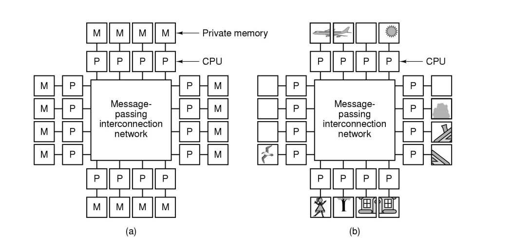
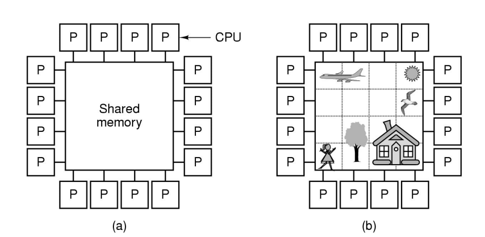
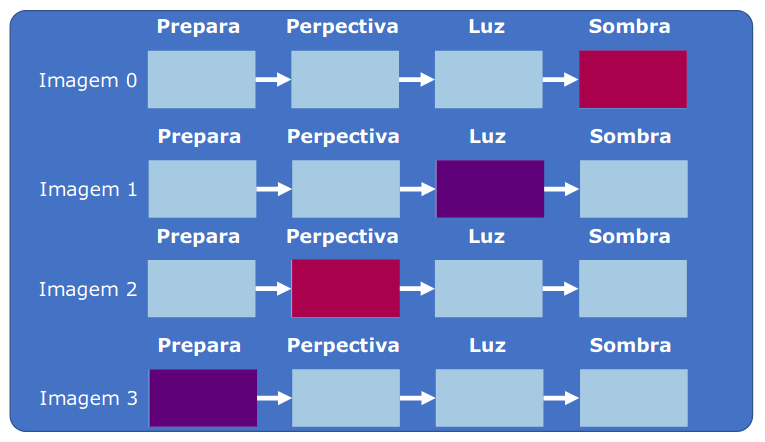

# RESUMO PROGRAMAÇÃO CONCORRENTE - PARTE 1

**LINKS ÚTEIS**

Vídeo aulas sobre programação concorrente:

[Programação Concorrente: Definição de processo e multiprogramação](https://www.youtube.com/watch?v=lvcJxv-teC0&list=PLPrYObOisEDHo0zGqngAXoVQD5TaDtxzk)

Vídeo aula sobre Lei de Amdahl com exemplos de questões

[Lei de Amdahl](https://www.youtube.com/watch?v=QApHDvt8Hm4)

Vídeo aulas sobre implementações de travas

[Sistemas Operacionais - Aula 09 - Soluções de Espera Ocupada](https://www.youtube.com/watch?v=6wFCoa7x9BY)

MATERIAL EXTRA SOBRE SOBRECARGA

[](http://wiki.icmc.usp.br/images/e/e7/Aula-06-Avaliacao-Desempenho-Programas-Paralelos.pdf)

Modelo fork/join

[[FSPD] 05.5d: fork/join](https://www.youtube.com/watch?v=yFdTEDrme4Q)

Granularidade 

[[FSPD] 05.5a: granularidade do paralelismo](https://www.youtube.com/watch?v=T5GZqyLFjHc&list=PL-blDbur9o_4oEFxlqSIOzP2y3lK6V8Ol)

Vídeos explicativos sobre os algoritmos

[W6 L4 Bakery Algorithm](https://www.youtube.com/watch?v=3pUScfud9Sg&ab_channel=IntroductiontoOperatingSystems)

[W6 L3 Software solutions for critical sections](https://www.youtube.com/watch?v=UuSswiH7jpE&ab_channel=IntroductiontoOperatingSystems)

Operações atômicas em Java

[Evite SYNCHRONIZED usando operações ATÔMICAS!](https://www.youtube.com/watch?v=hSCJFSm4QQM)

Interrupções, travas e operações atômicas

[14.2 - Implementando Operações atômicas [SO UFAM]](https://www.youtube.com/watch?v=znpsblqoouw)

## Revisão de SO

### Processos e Threads

Podemos entender um **processo** como um **programa em execução** em uma máquina. Um processo **pode criar processos filhos**.

<aside>
💡 Em um computador com **uma única CPU** só é possível executar **um único processo por vez**.

</aside>

No caso exemplificado acima, como a CPU só tem um núcleo e é mono processada, os processos estão **concorrendo** pelos recursos de uma mesma CPU o tempo inteiro.  

Esse processo de concorrência ocorre em um período de tempo tão pequeno que ocasiona um efeito de **pseudoparalelismo**, isto é, o sistema não está executando processos de maneira paralela, porém esses são executados de uma maneira tão rápida que para o usuário do sistema computacional é praticamente simultâneo.

Ainda sobre processos, é válido destacar que **os processos** **são independentes entre si**, isto é, cada um tem suas **regiões de recursos não compartilhadas**. Processos podem compartilhar essas regiões de recurso, como memória, por exemplo, mas não por padrão. 

Já em relação as **threads**, essas compartilham suas regiões de recurso com a thread ou processo principal que a criou. Os processos filhos criados por um processo principal compreendem uma cópia exata do processo pai, para alterar essa condição é necessário que uma instrução do tipo exec seja realizada. Nas threads isso não necessariamente ocorre, dado que um fluxo de execução da thread pode executar um código independente.  

## Programação Concorrente - parte 1

## Paralelismo e Concorrência

**Paralelismo** é a capacidade de conseguir lidar com várias execuções ao mesmo tempo. Já a **concorrência** diz respeito a ter que lidar com várias execuções no mesmo momento que estão concorrendo pelos recursos. 

Desse modo podemos ter sistemas que são **paralelos e concorrentes**, **apenas paralelos** ou **apenas concorrentes**.

Sistemas **apenas paralelos** têm suas rotinas completamente independentes, isto é, cada thread ou processo em um sistema genuinamente paralelo executa de maneira que **não concorrem por recursos**.

Em sistemas **apenas concorrentes**, as rotinas estão **o tempo todo concorrendo pelos recursos** para conseguirem realizar suas atividades. Tome como exemplo um sistema computacional monoprocessado, no qual cada processo precisa ganhar completamente a única CPU para que consiga executar, o que causa um ambiente de constante concorrência.

Por fim, sistemas que são **ao mesmo tempo concorrentes e paralelos** somam características das duas descrições acima: os processos e threads executam de maneira independente, mas estão concorrendo por recursos dentro do sistema computacional. Nesse cenário, as rotinas podem concorrer por memória, processamento, dentre outros recursos. 

## Por que processar de forma paralela?

As principais motivações para programar de forma paralela são:

- Aumentar o nível de uso dos recursos disponíveis (evitar deixar estruturas ociosas)
- Melhorar o desempenho da execução diminuindo o tempo (explorar partes paralelizáveis do código)
- Algumas aplicações são inerentemente paralelas (por exemplo alguns tipos de simuladores, sistemas que atuam como dispatchers, necessidades da lógica do contexto)
- Quanto melhor se aproveitam os recursos disponíveis, menor é o gasto energético

**Algumas justificativas**

- O limite da Lei de Moore
    
    Sabemos que a Lei de Moore define que **o número de transistores dos chips dobra a cada intervalo de 18 meses, aumentando a capacidade de processamento dos mesmos**. Essa lei de manteve (e ainda resiste em alguns aspectos) por muito tempo, até que começamos a atingir as barreiras físicas. Alguns fabricantes já chegaram a atingir as barreiras térmicas relacionadas à quantidade de transistores por chip. Com relação ao desempenho, até meados dos anos 2000, os processadores tinham um crescimento de cerca de 52% da performance por ano, porém após essa data, o crescimento anual diminuiu significativamente para cerca de 21% por ano. 
    
- O tamanho dos circuitos
    
    Quanto mais se diminui o tamanho de um transistor para que seja possível aumentar a quantidade em um chip, mais complicado fica o design do sistema físico, além do aumento de problemas relacionados à interferência e a capacitância parasita, dado a curta distância dos enlaces. 
    
- O tamanho dos transistores
    
    É fato que a história conseguiu diminuir tanto os transistores ao ponto de conseguirmos colocar bilhões deles em uma pequena área. Porém, a diminuição do tamanho dos transistores faz com que o seu funcionamento também seja comprometido. Para entender melhor essa justificativa, lembre-se que um transistor é nada mais nada menos que uma chave. Essa chave tem seu funcionamento abalado pelo tamanho dos seus canais, dado que quanto menores pior é esse funcionamento. 
    
- Densidade de potência
    
    Quanto mais transistores colocamos em uma pequena área, maior será o seu aquecimento. Algumas escolhas de design, como a diminuição da potência dos transistores de 5v para 1v, auxiliou nessa melhoria. Além disso, quanto mais se perde energia na forma de calor, maior é o gasto energético e o desperdício e menor é a eficiência energética. 
    

Podemos concluir com essas justificativas que **não conseguimos construir máquinas arbitrariamente rápidas**, dado o foco do uso da programação paralela como desempenho. 

- Representações mais fiéis do mundo real
    
    O mundo real se apresenta de maneira paralela, e não apenas isso, mas de maneira concorrente. Os indivíduos atuam de maneira independente podendo interagir uns com os outros em um mesmo espaço de tempo e espaço. Sistemas que têm como finalidade essa simulação de representação do mundo real têm foco não apenas em paralelismo, mas também em concorrência. 
    

### Eficiência energética e programação concorrente

Alguns pontos discutidos acima mostram que utilizar de paralelismo na solução de um problema pode ser bastante **benéfico para melhorar a eficiência energética do sistema**: **utilizar todos os recursos disponíveis** impede que existam estruturas ociosas que irão apenas consumir energia sem produzir **trabalho útil**, por exemplo. 

Por outro lado, alguns **problemas inerentes das arquiteturas** atuais promovem a **ineficiência energética dos processadores**, como a diminuição dos circuítos e o aumento exponencial do número de transistores, aumentando, respectivamente, o **índice de capacitância parasita** do sistema e de **perda de energia útil na forma de calor**, fazendo com que haja **diminuição da eficiência**. 

Outros fatores que podem ser maléficos para a eficiência energética do sistema são relacionados com **escolhas no momento da programação**. Algumas implementações de travas, principalmente por quando existe **exclusão mútua por espera ocupada**, podem ocasionar níveis de ineficiência para a totalidade do sistema computacional. **A espera ocupada faz com que uma rotina aguarde para entrar em uma região crítica sem realização de trabalho útil (apenas “queimando CPU”)**, fazendo com que o processador responsável por executar aquela rotine disperdice aqueles instantes. 

### Paralelizando memórias: Memória Distribuída vs Memória Compartilhada

A principal diferença entre a abordagem de **memória distribuída** e **memória compartilhada** é relacionada às seguintes descrições:

→ **Memória distribuída**: cada porção de processamento tem **acesso a um recurso de memória exclusivo**, que podem ser acessados por outros núcleos, mas apenas via **mensagem explícita**.



→ **Memória compartilhada**: na memória compartilhada, **todos os núcleos têm acesso a uma mesma memória**, podendo ler e escrever nos mesmos particionamentos.

 



**Memórias compartilhadas** são inerentemente mais **fáceis de programas**, porém bem mais **difíceis de construir**. Isso se é dado pelo fato de que memórias compartilhadas necessitam de **sincronização**, dado que toda sua implementação é realizada de maneira abstraída, sem a necessidade de comunicação explícita. Por exemplo, em um cenário como esse, duas threads sendo executadas em dois núcleos diferentes podem tentar escrever em um mesmo arquivo, mas, para impedir que uma inscrição sobreponha a outra de maneira prejudicial, podemos implementar mecanismos de sincronização, extremamente necessários para esse caso.

Já as **memórias distribuídas** são **fáceis de construir**, porém **difíceis de programar**. Isso se deve ao fato de que, como cada núcleo se preocupa com um recurso particular, não há grande preocupação com sincronização, porém haverá preocupação por parte dos programadores para realizar acessos compartilhados de memória, visto que isso tem que ser realizado por meio de **comunicação explícita**.

### Programando com vários núcleos

Dado que **não conseguimos construir máquinas arbitrariamente mais rápidas**, podemos **utilizar vários processadores simples** para realizar uma tarefa de **maneira mais ágil**. 

Além disso, **processadores lentos trabalhando em conjunto realizam mais trabalho útil para a mesma energia gasta do que um processador mais rápido**.

<aside>
💡 **REALIZAR TRABALHO ÚTIL** pode ser entendido como **COOPERAR PARA ATINGIR OS OBJETIVOS** (em outras palavras bem mais simples, fazer algo que preste 😃)

</aside>

## Fatores de Performance

$$
speedup = Tsequencial/Tparalelizado
$$

Podemos definir o ***speedup*** como sendo o ganho de tempo com a paralelização de uma rotina (a razão entre o tempo sequencial do problemas e o tempo paralelizado).

$$
Eficiência = speedup/N
$$

Onde,

N = quantidade de núcleos do processador

Já **eficiência** está relacionada com o quão bem os recursos foram paralelizados no sistema.

Quando pensamos em paralelizar um programa, temos que ter em mente que:

- Um sistema com N processadores **dificilmente** conseguirá aumentar seu desempenho em N
- Todo programa tem uma **parte sequencial**, mesmo que esta esteja escondida.
- Apenas a **porção paralelizável (*f*)** será **beneficiada** pelo multiprocessamento

**LEI DE AMDAHL**

A **Lei de Amdahl** é utilizada para calcular a máxima velocidade esperada pra um sistema que foi **em parte paralelizado**. 

$$
speedup = 1/[(f/N) + (1 - f)]
$$

Onde, 

*f* = parte paralelizável do problema

N = número de núcleos do processador

**RESULTADOS ACERCA DA LEI DE AMDAHL**

Adicionar hardware quando a porção paralelizável do software é baixa pode ter **ganho não significativo**. Desse modo, saber como paralelizar dentro da quantidade de recursos disponível pode ser mais significativo. 

É importante destacar que **a porção de código sequencial limita o speedup da execução mesmo se houver paralelização**.

**CONTORNANDO A LEI DE AMDAHL**

Para contornar as conclusões da Lei de Amdahl, podemos pensar em algumas alternativas:

- **PROCESSADORES HETEROGÊNEOS**
    
    Ao invés de termos uma quantidade N de núcleos com a mesma quantidade de recursos, podemos dividir esses em **cores de diferentes capacidades**. 
    
    Processadores heterogêneos podem suprir a limitação do speedup nas partes sequenciais, tendo em vista que os núcleos mais simples podem executar as rotinas paralelizáveis e as partes sequenciais serem executadas nos núcleos com maior poder de processamento. 
    
- **AUMENTAR O PROBLEMA**
    
    Se potencializamos o problema em suas partes paralelizáveis conseguimos ter um ganho suficiente de speedup na Lei de Amdahl.
    
    Segundo a **Lei de Gustafson,** a **complexidade do problema aumenta à medida que os recursos disponíveis para sua resolução aumentam**. Isso é visível dentro da própria evolução de software: com o aumento da capacidade do hardware, os softwares passaram a serem bem mais complexos e a terem uma gama de novas aplicações, necessitando até de arquiteturas distribuídas para seu pleno funcionamento. 
    
    Pela Lei de Gustafson, podemos forçar que resoluções, iterações, cálculos, dentre outros aspectos, sejam alterados de modo que infle o tamanho do problema e o poder computacional aumentado seja melhor aproveitado. 
    
    Ainda dentro desse contexto, **soluções de software menos eficientes** do ponto de vista de código são muitas vezes **melhor paralelizáveis**. Isso se deve ao fato de que a melhoria dos algoritmos para atingir níveis de complexidade próximos ao ótimo são realizadas para **evitar a** **repetição de tarefas**, o que causa grande dependência entre as estruturas de dados. Quanto menos ótima é a solução, mais trabalho repetitivo se tem, consequentemente menos as estruturas dependem entre si e mais paralelizável é o problema, dada esta característica. Portanto, aumentar a complexidade do problema pode ser viável se a alternativa é utilizar o poder computacional inerente ao contexto. 
    

**AMDAL vs GUSTAFSON**

**AMDAL**

- Visão pessimista
- Aumentar o índice de paralelização não é viável se o meu problema continua sendo o mesmo

**GUSTAFSON**

- Visão otimista
- Parte da premissa de que os problemas são ajustáveis e podem crescer para demandar mais processamento

## Divisão do trabalho

- **GRANULARIDADE**
    
    Considerando que uma rotina pode ser paralelizada em tarefas independentes (uma rotina possui parte paralelizável). A forma com que essas tarefas são alocadas à nível de grão, isto é, o tamanho que elas são subdivididas, pode interferir diretamente na resolução do problema. Podemos compreender a granularidade como sendo a **forma que devemos dividir as rotinas paralelizáveis** levando em consideração o **formato das tarefas**, a **infraestrutura disponível** e o **tipo** da mesma, além da **existência de outras demandas externas em execução**. 
    
    **Grãos grandes**
    
    Em um ambiente homogêneo, se as tarefas forem todas de tamanhos distintos isso pode atrasar a fase, tendo em vista que teremos a capacidade de grão para complexidades diferentes de tarefas. Além disso, se temos uma quantidade de cores menor que de tarefas é evidente que de toda forma haverá algum tipo de espera para que todas as tarefas possam ganhar algum processador e finalizar sua execução. O mesmo em ambientes heterogêneos: se temos tarefas iguais executando em um processador assimétrico, pode haver algum tipo de espera que atrase o processamento. 
    
    **Grãos pequenos**
    
    A espera quando se têm grãos pequenos para processamento é bem menor, porém, em contrapartida, o overhead e a contenção é bem maior, tendo em vista a maior disputa de threads para ganhar a quantidade limitada de recursos. 
    
    **Alocação** 
    
    A forma com que as tarefas são alocadas para tomar os recursos também é importante de ser levada em consideração. Em uma implementação de **filas compartilhadas**, a concorrência tende a ser maior, tendo em vista que todas as tarefas são vistas e disputam todos os núcleos. Já as **filas privadas** diminuiriam esse problema, tendo em vista que cada núcleo teria uma fila de execução própria, mas pode ocasionar o aparecimento de núcleos ociosos e outros com maior contenção. Na estratégia de **work-stealing** núcleo pode “roubar” uma tarefa da fila de outro núcleo se esse estiver sem tarefas e propenso a entrar em ócio, porém podem aumentar o risco de problemas de concorrência.
    
    <aside>
    💡 **RESUMINDO O RESUMO** 🙃: Paralelizar demais as tarefas (grãos muito pequenos) faz com que o overhead (a sobrecarga de concorrência) seja alto e isso prejudica o sistema, dado que há perda de tempo na disputa de recursos. Paralelizar de menos faz com que exija mais tempo sequencial na execução das rotinas, o que também pode ser maléfico, porém grãos maiores têm maior possibilidade de melhoramento de desempenho. [Linkei um material extra explicando melhor sobre isso]
    
    </aside>
    
- **LOCALIDADE**
    
    Como podemos relembrar de SO, processos e threads tendem a consumir recursos que já foram acessados de maneira próxima (no grão de tempo e também no de espaço), a isso damos o nome de **localidade de referência**. Para mitigar esse problema, é bem mais barato armazenar esses dados muito acessados de maneira próxima, utilizando memórias cache, por exemplo. 
    
    Problemas de localidade podem aumentar o risco de problemas de concorrência, desse modo podemos ter algumas alternativas para mitigar esses problemas:
    
    - Duplicação das estruturas de leitura para evitar sobrecarga de acesso
    - Agrupamento das tarefas em filas privadas
    - Aceitar resultados antigos ou aproximados (alguns sistemas que utilizam bancos de dados optam por essa estratégia)
- **ESCALABILIDADE**
    
    A escalabilidade é a qualidade de **manter um desempenho e uso dos recursos de maneira ajustável**, isto é, à medida que o problema cresce, o desempenho para sua resolução também é mantido.
    
    Para esse aspecto, existem algumas constatações interessantes:
    
    - Algumas **soluções menos eficientes conseguem ser melhor paralelizáveis**. Desse modo, rotinas mais eficientes podem ser melhor tratadas de maneira sequencial, porém as menos eficientes podem ganhar essa característica em paralelização. Imagine um cenário que se deseja somar, de maneira paralela, os números de um vetos de inteiros de tamanho N, tendo uma quantidade N/2 de cores. A solução mais simples para ser pensada é realizar essa soma dois a dois, repetindo o mesmo com os resultados até que todos os números sejam somados. Em primeiro momento todos os núcleos estariam sendo utilizados, porém à medida que a solução vai avançando, mais núcleos ficam ociosos. A complexidade dessa solução é O(log n).
    - A **escolha da arquitetura** entre monolítica ou multicamada pode importar para a solução também. Se o problema exige uma requisição única, uma monolítica é perfeitamente suficiente, porém se crescemos isso para uma quantidade maior de requisições, uma arquitetura multicamada pode ser bem mais escalável.
    
    É seguro pensar sistemas de forma grande (mais exagerada) de início e ir diminuindo a escalabilidade se necessário. Além disso, **aumentar a quantidade de processadores não é a resposta**!
    

## Cooperação

Sabemos que em paralelismo podemos ter várias threads e processos trabalhando juntos (e disputando recursos) para resolução de um problema. 

Ter esses processos e threads trabalhando em conjunto é desafiador, tendo em vista que muitas vezes é necessária a comunicação entre essas estruturas, tendo que manter a **sincronização** e evitar interferências.

Também relembrando SO: podemos realizar um esquema de memória compartilhada para isto, utilizando **buffers de memória** para a comunicação e **travas e semáforos** para realizar a **sincronização**.

**ENCONTRANDO AS PARTES PARALELAS**

Para identificarmos as partes paralelas de um programa e como podemos paralelizá-las dentro da nossa solução, podemos:

→ **Decompor o domínio**: subdividir um conjunto de atividades paralelizáveis para serem processadas nos núcleos da arquitetura disponível. 

→ **Decompor a tarefa**: tendo as tarefas subdivididas, podemos encontrar ainda mais passos que podem ser paralelizáveis dentro dela. 

<aside>
💡 Um exemplo:
Imaginemos um cenário no qual teremos que processar N imagens. Cada imagem pode ser processada de maneira independente, portanto podemos **decompor o domínio** desse problema em múltiplas threads processando imagens de maneira paralela. Porém, algumas regiões dessas imagens podem ser também processadas de maneira paralelizável, por mais que ocorram algumas relações de precedencia, sendo assim, podemos também **decompor a tarefa** em questão.

</aside>

Um exemplo já muito visto acerca de decomposição do domínio é o **pipelining**. Nessa estratégia, existe uma **decomposição do domínio** que por sua vez subdivide-se em **decomposição de tarefas**, obedecendo uma ordem de prioridade.



Na imagem acima, que representa uma estratégia de **pipelining** aplicada à renderização de uma imagem, podemos ter as partes da imagem (vertical) divididas em **domínios** e as etapas de renderização de cada uma dessas partes (horizontal), subdivididas em **tarefas**. Imagine que a renderização da Imagem 3 dependa da Imagem 2, que por sua vez depende da Imagem 1 e que depende da Imagem 0. Com esse esquema é possível executar algumas tarefas de maneira paralela e ainda **obedecer a ordem de precedência** necessária para a execução total da resolução do problema.

Alguns problemas que envolvem dependência forçam um processamento sequencial, em alguns deles queremos isso, como no caso dos algoritmos de criptografia: forçar um **processamento sequencial aumenta a complexidade** para que uma solução seja quebrada.

## Aplicando paralelismo e concorrência

**Modelo fork/join**

Nesse modelo, existe uma única thread ativa no início da execução (**thread principal**). Essa thread, que executa porções sequenciais, é responsável pela criação de outras threads (**forks**) para executar porções paralelizáveis. Quando a porção paralela termina de ser executada, as execuções das threads se unem em um ponto da thread principal (**join**), que segue sua execução.  


Como mostrado na imagem ilustrativa, o modelo fork/join para a criação de threads é **muito útil em cenários nos quais existe uma grande incidência de loops**. Cada instância do loop pode ser paralelizada em uma thread e, após esperar pela execução total do bloco, a thread principal pode seguir a sua execução, realizando um join. 

Fork/join é bastante adequado para aplicações que contém certo **balanceamento de trabalho** entre as partes paralelizáveis (daí o uso adequado em estruras de loop). 


```java
//Exemplo de código com a rotina
// sequencial
public void sequencial() {
	for (i = 0; i < 100; i++) {
		executeThisFunction();
	}
}
```

É possível decompor o domínio dentro da estratégia fork/join, tendo em vista que as threads das porções paralelizáveis podem utilizar de particionamentos de recursos, como mostrado na imagem ao lado. 

Em uma aplicação mais exemplificada na prática, podemos imaginar um código sequencial que roda um loop, porém tem todas as suas iterações independentes. Podemos subdividir essa rotina sequencial em mais de uma rotina paralela, para este caso. 

O código ao lado poderia, por exemplo, executar em duas threads, cada qual iterando metade das iterações totais da rotina sequencial. A escolha da divisão da quantidade de threads depende do problema e do contexto. [*Tentei escrever esse exemplo, mas em Java é muito código para escrever um código paralelo* 😅]

## Sincronização

**Condições de corrida**

Relembrando SO mais uma vez: quando duas threads ou processos acessam uma memória ou variáveis compartilhadas é bem provável que aconteça uma **condição de corrida**. Condições de corrida são ocasionadas por interferências em regiões de memória compartilhada, principalmente se existem threads que escrevem nessa região de memória. As regiões do código propícias para a ocorrência de condições de corrida são chamadas de **regiões críticas**.

<aside>
💡 “*Uma condição de corrida ocorre quando dois threads acessam uma variável compartilhada ao mesmo tempo. O primeiro thread lê a variável e o segundo thread lê o mesmo valor da variável. Em seguida, o primeiro thread e o segundo thread executam suas operações no valor e eles correm para ver qual thread pode gravar o valor por último na variável compartilhada. O valor do thread que grava seu valor por último é preservado, porque o thread está gravando sobre o valor que o thread anterior escreveu.”
Fonte:* [https://docs.microsoft.com/pt-BR/troubleshoot/developer/visualstudio/visual-basic/language-compilers/race-conditions-deadlocks](https://docs.microsoft.com/pt-BR/troubleshoot/developer/visualstudio/visual-basic/language-compilers/race-conditions-deadlocks)

</aside>

Alguns casos comuns que provocam condições de corrida são **dependências entre threads e processos** (quando existe uma precedência ou dependência das saídas das execuções), **consistência de dados** (na maioria dos casos queremos que os dados escritos permaneçam da forma com que o processo/thread escreveu, sem interferência externas que mudem a consistência do dado) e **não-determinismo de soluções** (em casos de operações de ponto flutuante, por exemplo, as aproximações e arredondamentos podem deixar os dados não determinísticos dada a ordem das operações realizadas).

Para resolver o problema da condição de corrida, podemos utilizar estratégias de **exclusão mútua** em regiões críticas.

**Exclusão mútua**

A exclusão mútua pode ser implementada de diversas maneiras, algumas mais eficientes que outras, porém sempre devem apresentar as seguintes características:

→ **Safety**: a solução é segura e correta

→ **Liveness**: algo de positivo para a solução acontece

 ****Além disso é importante que a implementação não cause nenhuma das condições abaixo:

→ **Deadlock**: todos os processos envolvidos não conseguem progredir por estarem esperando pela execução um dos outros.

→ **Starvation**: um processo nunca consegue tomar a CPU

**Implementando exclusão mútua** 

É importante relembrar que **processos são estruturas independentes** e, apesar de compartilharem alguns recursos, **threads têm execução independente**. Desse modo, **threads/processos não são capazes de observar a execução dos demais**. Para que esses fluxos de execução sejam sincronizados, é necessária uma comunicação explícita. 

**“Protocolo do celular”** 

Nessa analogia, uma thread “ligaria” para a outra na tentativa de saber o seu status de acesso à região crítica. Porém, a comunicação nunca é garantida para esses casos, o que faria com que a propriedade de **liveness** não fosse atendida. Além disso, como uma thread estaria sempre esperando pela resposta da outra para tomar a região crítica, é fácil ocorrer um **deadlock**.

A comunicação entre os fluxos envolvidos deve ser persistente, pense em algo como uma comunicação por escrita.

**“Protocolo da lata”**

Já nesta analogia, cada fluxo teria uma quantidade de fichas (ou latas) para sinalizar que está acessando a região crítica. Sempre que um fluxo está para atingir a região crítica, este derruba uma lata em sinalização, fazendo o mesmo quando sair. Dessa forma, os demais fluxos podem observar se uma lata daquele fluxo está caída em posição par, indicando que a região crítica está em acesso, e aguardar para fazer sua entrada na região crítica quando uma lata de posição ímpar estives caída, indicando a saída. [*Considere uma indexação iniciando em 0 e indo até um índice N*]. 

O maior impasse dessa solução é que a quantidade de latas/fichas é finita. Em uma aplicação real, o “protocolo da lata” tenta resolver o problema de condição de corrida com uma interrupção, mas isso não é possível, tendo em vista que precisaríamos de um conjunto ilimitado de latas para que a solução fosse totalmente generalizada. 

**Protocolo da bandeira: Flags**

Uma forma mais efetiva de realizar exclusão mútua seria sinalizar de uma maneira mais clara que a região crítica está em acesso. Para isso, a thread ou processo que acessa região pode **levantar uma bandeira** indicando que está executando aquele código. À nível de implementação, uma **flag** pode ser entendida como uma variável compartilhada, uma para cada fluxo, na qual o mesmo seta o bit 1 quando ocupa a região crítica e o bit 0 quando sai dela. Desse modo, é possível que um fluxo de execução “levante a bandeira”, indicando que quer tomar a região crítica, e observe a flag do outro no momento de entrar, sendo assim, se o outro fluxo estiver com flag 0, a região está livre para ser acessada.

Porém, podem existir casos nos quais os dois fluxos levantam suas bandeiras no mesmo instante de tempo. Nesse caso, podemos pensar em uma abordagem de prioridade para resolver esse problema.

Imagine a existência da **thread A** e da **thread B** que concorrem pela mesma região crítica. Se A e B levantam suas bandeiras ao mesmo tempo, gentilmente **B pode ceder o seu lugar para A**, e isso acontece sempre que ambas as bandeiras levantam ao mesmo tempo. É uma solução que inibe a condição de corrida, porém causa **starvation** para um dos fluxos, nesse caso a thread B. No pior caso, no qual as duas bandeiras são levantadas ao mesmo tempo sempre, a thread A sempre ganha a região crítica e a thread B nunca consegue seu lugar.  

Essa solução não apresenta **deadlocks**, dado que um dos fluxos sempre ganha a região, porém **não é justo**, tendo em vista a grande probabilidade de **starvation**. 

**Algoritmos para implementação de exclusão mútua**

Na prática, as linguagens de programação já implementam soluções para exclusão mútua, portanto, não precisaremos codificá-las, porém é importante que haja o entendimento do funcionamento. 

**Algumas definições**

**Eventos** são acontecimentos no histórico de uma thread e **ocorrem unicamente em um instante**.

Podemos entender uma **thread** como sendo uma **sequência de eventos**. Além disso, **threads são máquinas de estados**, um evento pode transicionar para outro ou ser repetido em loop, por exemplo. 

Duas ou mais threads se **entrelaçam** se são executadas no mesmo instante de tempo, tendo seus eventos ocorrendo na soma dos instantes de tempo.

Um **intervalo** é o **instante de tempo entre dois eventos**. Intervalos de duas ou mais threads podem se sobrepor ou não, isto é, a execução de dois ou mais eventos pode ser simultânea ou sequencial. 

Podemos dar **precedência** ao acontecimento dos eventos. Notação:

A → B, se o evento inicial de A ocorreu antes do evento inicial de B.

Algumas conclusões acerca disso:

- A → A nunca é possível (irreflexiva)
- Se A → B então é impossível que B → A (antissimétrica)
- Se A → B e B → C, então A → C (transitiva)

Essa propriedade pode ser **parcial**, quando ocorre **concorrência** ou sem empates, quando há precedência total dos eventos. 

**Locks (travas)**

Uma trava é uma estrutura que impede que uma thread entre em uma região crítica. Abaixo está um exemplo de como a linguagem de programação Java lida com travas:

```java
private Lock lock;
private int value;
public void lockExample() {
	lock.lock(); // Trava na região crítica
	int temporary;
	try {
		temporary = value; //Região crítica dentro do bloco try
		incrementValue(value)
	} finally {
		lock.unlock() //Destrava quando a execução da thread sai da região crítica
	}
	return temporary;
}
```

No exemplo acima, a rotina **sempre é destravada** quando sai da região crítica. Podemos dessa forma garantir que não há **starvation** para essa solução, tendo em vista que todas as threads poderão ganhar o acesso da região crítica, assim como não há **deadlocks**, tendo em vista que o sistema consegue caminhar em sua execução (por mais que algumas threads estejam em espera).

Os exemplos antes vistos para **flags** podem ser implementados utilizando travas, de modo que uma trava é ativada sempre que lógica das bandeiras é seguida. 

## **Implementando travas**

**Algoritmo de Peterson**

O algoritmo de Peterson implementa uma trava com exclusão mútua por **espera ocupada**. Nessa categoria de implementação, quando um processo ganha a CPU, os demais processos ficam ocupados com alguma barreira até que o processo/thread ocupante deixe a região. 

Abaixo está uma implementação em Java comentada do algoritmo de Peterson:

```java
public void lock() {
	//Levantando a bandeira da thread i para que ela sinalize que 
	//quer ganhar a região crítica
	flag[i] = true 
	//Por hora, a minha vez é cedida para outra thread
	victim = i
	
	//Se a thread j está na região crítica e eu (thread i) sou a vítima,
	//então me ocupo com alguma rotina até que possa adentrar a região
	while (flag[j] && victim == i) {}; 
}

public void unlock() {
	//Abaixa a bandeira da thread sinalizando que ela saiu da região crítica
	flag[i] = false
}
```

Em uma rotina, chamaríamos lock() antes da região crítica e unlock() após a mesma.

A solução de Peterson **implementa a exclusão mútua**. Podemos conferir essa propriedade de maneira simples e dedutiva:

Em um certo estado do programa temos que a **Thread 0** (i = 0) e a **Thread 1** (j = 1) estão concorrendo pelos recursos de uma região crítica.

Quando a **Thread 0** está na região crítica:

flag[0] = true

victim = 0

Isso quer dizer que a Thread 0 quer ganhar a região crítica, mas se caso a Thread 1 também queira (ou já esteja nela), a Thread 0 cede a vez até que a Thread 1 baixe a bandeira.

Quando a **Thread 1** está na região crítica:

flag[1] = true

victim = 1

Isso quer dizer que a Thread 1 quer ganhar a região crítica, mas se caso a Thread 0 também queira (ou já esteja nela), a Thread 1 cede a vez até que a Thread 0 baixe a bandeira.

Perceba que os dois estados não podem ser verdadeiros ao mesmo tempo, dessa maneira, é possível habilitar que apenas uma thread esteja acessando a região crítica por vez.

O algoritmo de Peterson também é **livre de deadlocks**, isto é, as threads não ficam sempre esperando uma pela outra. Pelos mesmos motivos acima, podemos assegurar que:

- Uma thread sempre será vítima e outra não, mas nunca as duas estarão ocupando o mesmo estado, isto é, ambas não sendo vítima ou sendo vítima.
- Uma thread bloqueia apenas quando ela é a vítima e a outra está ocupando a região crítica.

Por fim, a solução também **livre de starvation**. Por mais que haja espera de uma pela outra, podemos garantir que todas as threads envolvidas sempre irão ganhar a região crítica em algum momento. Como as condições de estado das variáveis são sempre contrárias (se uma é verdadeira, a outra é falsa), não haverá espera infinita por parte de nenhuma das threads envolvidas, dado que a thread que toma, sempre sai da região crítica. 

Em resumo, o **Algoritmo de Peterson**:

→ Cede a vez para executar a região crítica, mas apenas se a outra thread quiser tomá-la.

→ É livre de deadlocks.

→ É livre de starvation.

→ Implementa exclusão mútua.

→ É aplicável somente para casos binários (com duas threads envolvidas). 

**Algoritmo Bakery**

Para sanar as limitações do algoritmo de Peterson, principalmente relacionado ao fato de que Peterson só suporta duas threads em sua implementação, podemos implementar o **algoritmo da padaria** ou **Bakery**.

O bakery **suporta mais de uma thread** em sua implementação e atende uma lógica **baseada em FCFS (First Come First Served)**. 

A ideia principal é que, cada thread pegue um número (uma ficha, no contexto da padaria 🙂) e espere até que este seja decrementado até que seja o menor. Dessa forma, o menor número é o primeiro que chegou e será o primeiro a ser atendido, prosseguindo, sempre que a fila da padaria anda, o número dos demais clientes esperando na fila é decrementado, até que novos números menores surgirão e serão atendidos. 

Implementando essa lógica em Java:

```java
public void lock(int id) {
	//Dessa vez, recebemos um id, que é a ficha de atendimento da nossa thread
	//Quando o cliente chega na fila da padaria, ele não tem ficha, portanto 
	//seu número é 0.

	for (int j = 0;  j < n; j ++) { //Visitando todos os clientes da fila...
		if (num[j] > num[id]) { //Se existirem pessoas com fichas maiores...
			num[id] = num[j]; //Eu recebo essa ficha
		}		
		num[id] ++; //Até que chegue no final da fila e receba uma ficha exclusiva
								//(A última posição incrementada de 1)
	}

	
	for (int j = 0;  j < n; j ++) { //Visitando todos os clientes da fila...
		while((num[j] != 0) && (num[j] < num[id])); //Enquanto não chegar a vez, espere
	}
}

public void unlock(int id) {
	num[id] = 0; //O cliente saiu da padaria, se ele voltar, tem que entrar
							//novamente na fila	
}
```

Essa solução de implementação parece funcionar, mas apresenta um problema:

Numa aplicação real, uma thread pode ter rapidamente passado pelo for do contador e perdido o processador, desse modo, uma outra thread pode ter o mesmo contador que ela, causando um conflito da solução. 

Uma solução para esse problema seria utilizar flags para indicar que se está escolhendo uma ficha para a thread que solicitou o lock:

```java
public void lock(int id) {
	//Dessa vez, recebemos um id, que é a ficha de atendimento da nossa thread
	//Quando o cliente chega na fila da padaria, ele não tem ficha, portanto 
	//seu número é 0.
	choosing[id] = true; //Sinalizamos para as demais que estamos escolhendo
	for (int j = 0;  j < n; j ++) { //Visitando todos os clientes da fila...
		if (num[j] > num[id]) { //Se existirem pessoas com fichas maiores...
			num[id] = num[j]; //Eu recebo essa ficha
		}		
		num[id] ++; //Até que chegue no final da fila e receba uma ficha exclusiva
								//(A última posição incrementada de 1)
	}
	choosing[id] = false; //A ficha foi escolhida e o cliente está na fila
	
	for (int j = 0;  j < n; j ++) { //Visitando todos os clientes da fila...
		//Enquanto não chegar a vez, espere	
		while(choosing[j]);
		while((num[j] != 0) && ((num[j] < num[id]) || 
				((num[id] == num[j]) && j < id))); 
	}
}

public void unlock(int id) {
	num[id] = 0; //O cliente saiu da padaria, se ele voltar, tem que entrar
							//novamente na fila	
}
```

Assim como a solução de Peterson, o algoritmo da padaria **é livre de deadlocks e de starvation**, além de também implementar a exclusão mútua (e por espera ocupada).  

Essa última solução proposta funciona, porém, em sistemas em que existem muitas threads ou que a arquitetura para representação é limitada, essa solução pode ocasionar um **overflow**, dado que sempre há o incremento de um número. 

Uma forma de mitigar esse problema é, ao invés de utilizar fichas numéricas, utilizar flags por posição.

**Pontos negativos da exclusão mútua**

- **Interrupções assíncronas**
    
    A ocorrência de interrupções de maneira assíncrona podem prejudicar o funcionamento das demais threads que querem tomar a região crítica.
    
- Processadores heterogêneos
    
    Tempos de clock diferentes, tendo em vista o contexto de processadores heterogêneos, podem dificultar a sincronização
    
- Tolerância à falhas
    
    A tolerância à falha da exclusão mútua não é tão desejável para certos tipos de problema.
    

### Operações atômicas

Operações atômicas são operações **semanticamente compostas**, mas que são **realizadas de forma atômica** pelo processador.

<aside>
💡 Em outras palavras, são pequenos blocos de código que conseguem operar em um pequeno grão de sincronização.

</aside>

Essas operações são **não bloqueantes**, tendo em vista que são **executadas em um mesmo grão** e **evitam deadlocks**, com **tolerância maior à falhas**. 

<aside>
⚠️ As **operações atômicas** são **não bloqueantes**, mas isso não impede que uma rotina que utiliza de uma operação atômica seja bloqueante.

</aside>

Operações atômicas são um ótimo mecanismo para **implementar blocos básicos e sistemas que exigem alto desempenho**.

O desempenho de uma operação atômica é sem dúvida seu diferencial, mas a construção de algoritmos que sejam totalmente livres de bloqueio é ainda um desafio, dado que estamos trabalhando ainda com concorrência. Por exemplo, uma operação pode manipular uma variável de maneira atômica, porém quando isso acontece de maneira simultânea, perdemos essa propriedade. 

A semântica da implementação de uma operação atômica, em Java, está disposta abaixo:

```java
//Exemplo de operação atômica compare and swap
public synchronized int compareAndSwap(int expected, int newV) {
	int oldValue = value;
	//Comparando se o valor antigo é o esperado, caso seja, troca o valor atual
	//pelo valor novo
	if (oldValue == expected) value = newV; 
	return oldValue; // Retorna o antigo valor
}
```

Podemos perceber no exemplo de implementação acima que há a execução de toda a lógica de maneira **indivisível**.

Abaixo está um segundo exemplo, com uma função de incremento, representando a região crítica de uma solução paralela e concorrente que utiliza a solução de compare and swap acima:

```java
public int increment() {
	int v;
	// Enquanto o valor retornado for diferente do atual, não houve incremento...
  // Tente novamente...
	do {
		v = value.get() // Seta a variável com o valor atual
	} while(v != value.compareAndSwap(v, v+1));

	return v + 1
}

```

Operações atômicas também têm a propriedade de serem **lock-free**, isto é, **threads que estão paradas** (por exemplo, por ventura perderam o processador), **não atrapalham o funcionamento das demais**. Além disso, também são **wait-free**, ou seja, as threads não são atrapalhadas por outras que estão fazendo progresso. 

### Monitores

Em Java, todo objeto herda da classe padrão Object uma **trava de monitor**. A forma mais simples de utilizar essa trava do ponto de vista que ela foi implementada por padrão é utilizando a marcação **synchronized**. 

Um monitor permite que ocorra **exclusão mútua** e **monitoramento sem espera ocupada**. Essa melhoria é bastante significante, tendo em vista que a espera ocupada apresenta uma grande gama de gasto energético e de processamento (espera ocupada queima CPU!).

Na implementação de um monitor, a thread que não consegue atingir a região crítica pode temporariamente perder a CPU e “dormir”, de modo que poderá ser acordada quando a thread corrente na região crítica sair. Em Java, são três as estruturas de implementação notáveis para realizar a sincronização com uso de monitores:

→ wait() : inicia a espera (lock!)

→notify() : notifica uma thread de que a região crítica está livre (acorda a thread!) 

→notifyAll() : notifica todas as threads de que a região crítica foi liberada.

É importante lembrar que **toda instância possui sua trava**, mas também que **a classe associada possui outra**. O mal uso e não conhecimento dessas duas estruturas podem causar **contenção**. 

Outra propriedade notável dos monitores é que sua trava é **reentrante**, isto é, a trava possui um “dono” que pode adentrar a região crítica diversar vezes quando quiser. Esse tipo de estrutura é bastante útil para travamentos ocorridos em **estruturas recursivas**, tendo em vista que se não houver reentrância nessas situações haverá o **ocasionamento de um deadlock**. 

**TRAVAS vs MONITORES**

**TRAVAS**

Travas permitem a definição de regiões críticas menores, além de, dada a menor abstração de sua implementação, favorecem funcionalidades mais avançadas, como timeout, justiça, interrupções, dentre outros aspectos

**MONITORES**

Como os monitores são implementações próprias das linguagens de programação, o seu nível de abstração também é maior. Tendo isso em vista, são menos configuráveis e podem favorecer mal uso, mas existe a facilidade de utilização com o destravamento automático das regiões críticas e implementação sem uso de espera ocupada.