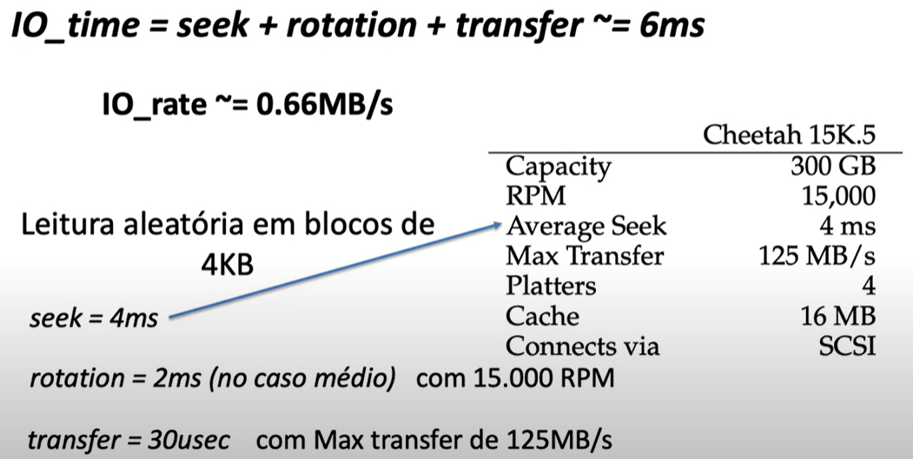
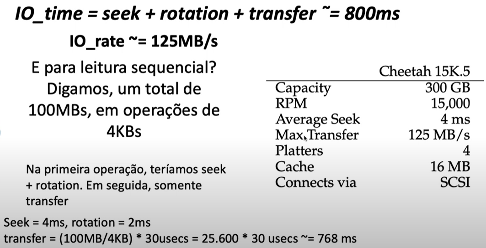
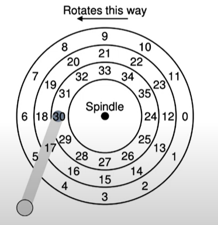

## Como é dada a organização de um disco rígido?

Em um esquema de um disco rígido com dois pratos, cada prato tem duas superfícies magnetizadas, a de cima e de baixo, e nessas superfícies que são feitas a gravação dos dados e a leitura dos dados armazenados no disco, podemos escrever em ambas as superfícies e para cada uma é necessário um head e um arm.

O disco é organizado em unidades de leitura e gravação, são os setores, sempre lê e escreve para um setor, nunca meio setor, os setores tem 512bytes tipicamente, podendo variar. A track(trilha) é um conjunto de setores com mesma distância para o centro do disco.

em um disco menos simplificado o atraso da leitura de um setor não vai depender apenas da velocidade de rotação do disco, mas também do seek time(tempo de posicionamento da head de gravação sob a trilha mais externa).

Existem pelo menos 4 fases para posicionar essa cabeça, o tempo exato vai depender das características e aspectos físicos do disco:

    a. Acceleration: acelerar a cabeça que estava parada
    b. Coasting: ápice de aceleração
    c. Deceleration: desaceleração da cabeça
    d. Settling: posicionamento da cabeça exatamente sob a outra trilha(só essa fase dura alguns ms a mais)

## Como é calculado o desempenho de um disco real?

IO_time = seek(posicionamento da cabeça) + rotation + transfer(tempo que a cabeça de leitura ou gravação vai levar pra transferir o conteúdo processado).

 

O desempenho no acesso ao disco depende muito da carga de trabalho que você está executando, comparando os dois exemplos com as duas cargas de trabalho distintas,  podemos perceber que a carga sequencial é muito mais rápida de ser processada do que a carga aleatória. Nesse caso, comparando a IO_rate, a sequencial é aproximadamente 189x mais rápida que a aleatória.

## Escalonamento de requisições em discos rígidos

 
 
Em um disco rígido menos simplificado, quantos movimentos do braço precisamos para processar a sequência[6, 31, 8, 24]? considere movimento como a movimentação de uma trilha para outra. No total, 8, do 30 para o 6 são duas trilhas, do 6 para o 31 são mais duas trilhas, do 31 para o 8 são mais duas trilhas, e do 8 para o 24 são duas trilhas.

Anteriormente, vimos que essa movimentação da cabeça e posicionamento da mesma sobre uma nova trilha demora muito tempo, então quanto mais movimentos forem necessários maior será o tempo gasto para processar toda essa sequência de requisições, por isso, escolher qual requisição executar em seguida(escalonar) é muito importante.

Uma forma melhor de fazer essa requisição, seria usando a sequência[31,24,6,8], do 30 para 31 não seria necessário nenhum movimento, do 31 para o 24 também não, do 24 para o 6 são duas trilhas e do 6 para o 8 não precisa de movimento, totalizando 2 movimentos apenas.

Diferente do caso de escalonamento de processos, em escalonamento de requisições de IO podemos ter um “chute” adequado de quanto tempo uma requisição irá durar, podemos usar aproximações do algoritmo SJF(shortest job first), que minimizam o tempo de espera médio das requisições.

## Qual o algoritmo de escalonamento que pode ajudar a diminuir o tempo de seek/posicionamento?

SSTF(shortest seek time first) - dado um conjunto de requisições, escolher sempre a que está mais próxima da cabeça de leitura/gravação. Em relação a desempenho, o algoritmo é muito bom, porém, possui um problema de inanição(starvation) e uma requisição pode “nunca” ser atendida por não ter prioridade de execução. 

Uma maneira de corrigir esse erro é usar o SCAN(algoritmo do elevador) que faz com que a cabeça vá da trilha mais interna para a mais externa e depois volte para a mais interna, processando cada requisição que exista em cada uma das trilhas, e só quando não existir mais requisições na trilha em questão, a cabeça se posicione sobre outra trilha.

Uma variação bem comum do algoritmo do elevador é o C-SCAN, esse algoritmo vai da trilha mais interna até a mais externa processando as requisições em cada trilha, porém, após terminar de atender às requisições da trilha mais externa, volta imediatamente para a trilha mais interna e da interna vai novamente para a trilha mais externa atendendo requisições de cada uma das trilhas pelo caminho.
OBS: No C-SCAN, a cabeça acessa igualmente todas as trilhas do disco, enquanto no SCAN a cabeça acessa mais a trilha do meio.

## Como podemos diminuir o tempo de rotation/latência?

Usando o caching da trilha: Ao invés de ler apenas um setor, é lida a trilha inteira. Com isso, o tempo de latência médio é duplicado para o primeiro pedido no par (trilha/cilindro), entretanto, os pedidos subsequentes têm o tempo de latência igual a zero.