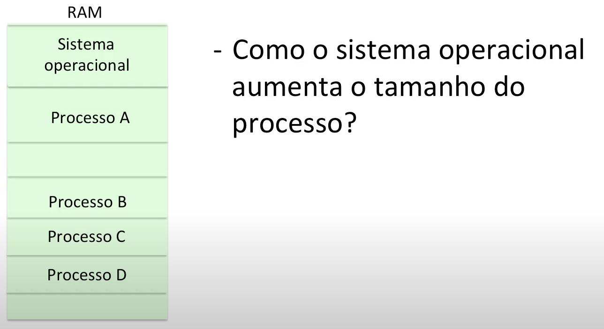

## Introdução

Funções do gerente de memória:
  a. Alocação de memória: definir quais pedaços da memória vai ser ocupado pelo SO e por cada um dos processos que precisam ser executados.
  b. Programar a CPU para relocação de endereços.
  c. Programar a CPU para proteger a memória.

O processo é criado a partir do arquivo executável. Esse arquivo executável na realidade só preciso armazenar o código e os dados iniciados, todo o restante(dados não iniciados, monte e pilha) só precisam existir na hora que o processo começa a executar, portanto, eu só preciso saber o tamanho dessas áreas de memória e essa informação é guardada no cabeçalho. Dessa forma, quando o executável é executado a imagem do processo pode ser recriada a partir do executável.
   
mais especificamente, como o compilador gera endereços nesse código que vão acessar as variáveis que estão armazenadas em dados, monte e pilha?
  a. Em relação à pilha, é muito simples porque o endereço é sempre uma referência a partir do apontador do stack pointer que aponta para o topo da pilha.
  b. Por outro lado, o monte e os dados iniciados precisam ser acessados com seus endereços, esses endereços são calculados de acordo como as áreas de memória são alocadas para armazenar essas variáveis.

O compilador gera endereços a partir de um espaço de endereçamento lógico, ou seja, o compilador cria uma abstração, que é esse espaço de endereçamento lógico, assumindo que o programa vai ser carregado no endereço zero e vai até o tamanho T.

As instruções armazenadas na memória contêm endereços lógicos, para acessar a localização correta, os endereços lógicos precisam ser relocados nos endereços físicos correspondentes, para que isso aconteça, o SO precisa configurar ou programar a CPU de forma adequada.

Além disso, o SO também precisa configurar ou programar a CPU de forma adequada para proteger a memória, de modo que de nenhuma maneira seja referenciada uma área que está fora do processo em questão, podendo pertencer a outro processo ou até mesmo ao SO.

## Gerência de memória sem virtualização

Os primeiros modelos de gerência de memória não tinham virtualização e seguiam as seguintes premissas: todo o processo é carregado na memória e o processo é carregado de forma contígua na memória. Nesse caso a alocação de memória era feita em partições fixas, onde a RAM era dividida em partes iguais e cada processo poderia usar uma partição.

Um dos problemas desse tipo de estratégia de alocação, é a ocorrência de fragmentação interna, ou seja, pedaços da memória que estão livres mas não podem ser alocados a um outro processo. Quanto mais processos eu tiver na memória, menos chance da CPU ficar ociosa.

As partições dinâmicas oferecem uma maneira mais eficiente de usar a memória mas não estão imunes a fragmentação da memória, nesse caso, ocorrem as fragmentações externas, que por sua vez, são tamanhos muito pequenos de memória que não podem ser aproveitados por outros processos.

Uma alternativa seria alocar o processo sempre na maior área de memória disponível, isso vai fazer com que os fragmentos sejam os maiores possível, minimizando as chances de fragmentação externa.

Em relação aos endereços lógicos e sua relocação, os endereços lógicos são somados ao registrador base, essa soma será seu endereço físico.

Em relação à proteção da memória:
  a. Existirá sempre um registrador base e um registrador limite para delimitar onde começa e onde termina cada processo.
  b. Endereços físicos são verificados antes de acessar a memória.
  c. Endereços físicos devem ser maiores que o valor do registrador base e menores que o valor do registrador limite.
  d. Se o endereço físico cai fora dessa faixa, uma exceção é lançada.

## Swapping e Memória Virtual

Se o espaço arbitrado não for suficientemente grande o processo não vai conseguir executar, idealmente o SO deve tomar atitude para crescer o processo.

Como o sistema operacional descobre que o processo precisa crescer?
  a. O monte cresce(ou diminui) em resposta a uma chamada ao sistema.
  b. A pilha cresce quando uma nova função é chamada, se o topo da pilha ultrapassa o valor do registrador limite, será lançada uma exceção.  
  

No caso do processo A, basta mudar na tabela de processo o tamanho do processo, mas no caso do processo C é necessário swap out, seguido de swap in.

O swap é usar uma área do disco para armazenar um processo e depois trazer esse processo para a memória, quando um processo precisa crescer e não existe espaço livre suficiente na memória, ele é movido para o disco e lá é alterado seu tamanho, o mesmo processo só será movido de volta à memória quando um espaço igual ou maior ao seu novo tamanho estive livre. Um processo que está momentaneamente armazenado no disco não pode executar.

O swap out é o alocamento temporário de um ou mais processos no disco, por sua vez, o swap in é o alocamento de um ou mais processos que estavam no disco para a memória.

O swapper, primeiro tenta fazer swap in de processos.
  a. Processos prontos para rodar.
  b. Mais prioritários.
  c. Processos menores.

Se existe um processo pronto para rodar no disco e não há espaço na memória, tenta fazer swap out.
  a. Processos bloqueados.
  b. Processos maiores.

A ideia de memória virtual estende a ideia de swap no sentido de que também permite o aumento do grau de multiprogramação à medida que mais processos podem ser carregados na memória. Só as partes dos processos que são efetivamente necessárias para que eles sejam executados vão ser carregados na memória física, todo resto do processo fica residente no disco(memória virtual).

Benefícios:
  a. Mais processos podem ser carregados na memória ao mesmo tempo.
  b. Processos podem ser maiores que a memória física.

Desafios para implementação de memória virtual:
  a. Alocação de memória(Que pedaços do processo devem estar na memória e onde esses pedaços são alocados na memória?)
  b. Um processo poderá ter vários “fragmentos” do seu espaço de endereçamento lógico carregados na memória(Como fazer relocação de endereços lógicos e como proteger a memória?)

