Gerenciamento de memória: Para programadores, idealmente grande, rápida, não volátil e de baixo custo (não é realista)

Hierarquia de memória: hierarquia entre os diferentes tipos de memória.

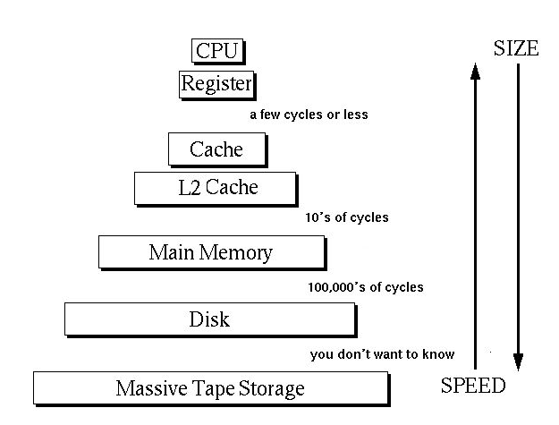

Funções do gerenciamento de memória:
* Gerenciar a hierarquia de memória
    * Gerenciar espaços livres/ocupados
    * Alocar e localizar processos/dados na memória
* Controlar as partes que estão em uso e as que não, com o objetivo de:
    * Alocar memória aos processos, quando estes precisarem
    * Liberar memória quando um processo termina
    * Tratar problemas de swapping (tirar conteúdo de memória principal e colocar no disco/tirar conteúdo do disco e colocar na memória principal)

Monoprogramação:

* Mainframes antigos
* Usado em alguns smartphones
* Primeiros computadores pessoais

Como armazenar n processos na memória?
* Dividir a memória em n partições de tamanho fixo
* Não necessariamente iguais
* Ao chegar um job, coloque-o na fila
* O espaço que sobrar não será utilizado

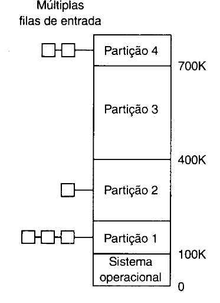

Como dar a cada programa seu próprio espaço de endereço de modo que o endereço 28 em um seja diferente em outro?
* Base e Limite:
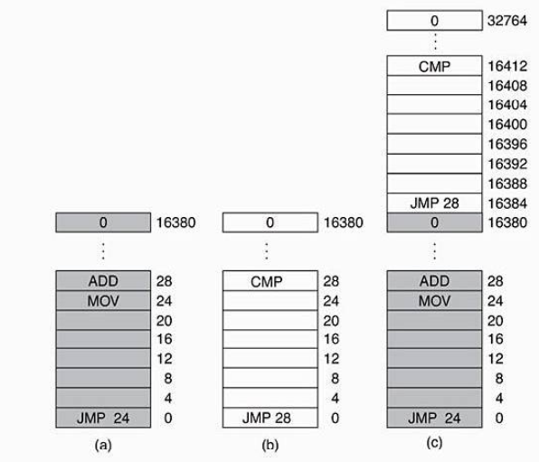
    * A CPU adiciona o valor base ao endereço
    * Verifica se o endereço é maior ou igual ao limite
    * Método obsoleto

MMU: Dispositivo de hardware que transforma endereços lógicos em endereços físicos (operação feita acima na multiprogramação)

Memória particionada:
* Partições fixas: Partição depois de criada, não altera seu tamanho na memória, com o encerramento de processos, desperdiçam memória. Desperdiçam memória, mais simples. No particionamento físico (fixo) existe fragmentação interna.
* Partições variáveis:  Tamanho e número de partições variam, Otimiza a utilização da memória. Partições são dinamicamente alocadas, fragmentação interna e externa

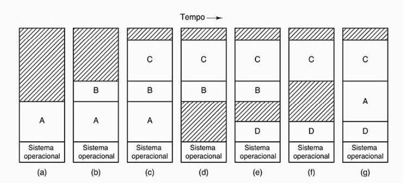

Swapping: Chaveamento de processos entre a memória e o disco;
* Swap In: mandar do disco para memória.
* Swap Out: mandar da memória para o disco.

Estruturas de gerenciamento:
* mapa de bits (bitmaps)
    * Memória dividida em unidades de alocação
    * cada unidade corresponde a um bit no bitmap
        * 0 -> Livre
        * 1 -> Ocupado
* Lista encadeada(linkedlist)
    * Manter uma lista ligada de segmentos de memória livres e alocados

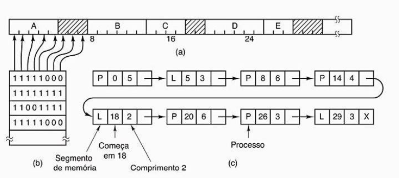

Algoritmos de alocação:

* First-Fit: A primeira partição que o processo cabe, ele entra.
* Next-Fit: Faz uma fila circular e guarda o último lugar que estava.
* Best-Fit: Pega o que melhor se encaixa, diminuindo assim os tamanhos dos “buracos” na memória.
* Worst-Fit: Tenta alocar para as maiores partições, fazendo com que assim, os buracos criados possam ser os maiores possíveis.

## Memória Virtual

Técnica que usa a memória secundária como uma “cache” para partes do espaço dos processos. Usa endereços virtuais e não físicos (usa MMU).

* Paginação:
    * O tamanho dessas páginas será próximo de 4K.
    * Espaço de endereçamento virtual dividido em páginas virtuais
* Segmentação:
    * Blocos de tamanho arbitrário
    * Contém o **apenas** um mesmo tipo de informações (ex: dados, pilha) diferente da paginação
* OBS: Muitos sistemas operacionais paginam e segmentam ao mesmo tempo com o objetivo de ter o melhor dos dois mundos

### Paginação

* Páginas: Unidades de tamanho fixo no dispositivo secundário
* Frames: Unidades correspondentes na memória física (RAM)
* Page Fault: evento quando uma página que não está na RAM é referenciada
* Usa uma trap para carregar ou substituir uma página
* Tabela de páginas: estrutura para mapear uma página ao frame correspondente (cada processo tem um)
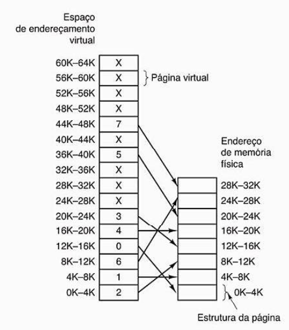

Busca de um endereço:
* É lenta
* Componentes:

    * Número de página(p): índice para uma tabela de página
        
    * Deslocamento de página(d): combinado com o endereço base para definir o endereço de memória físico que é enviado à unidade de memória

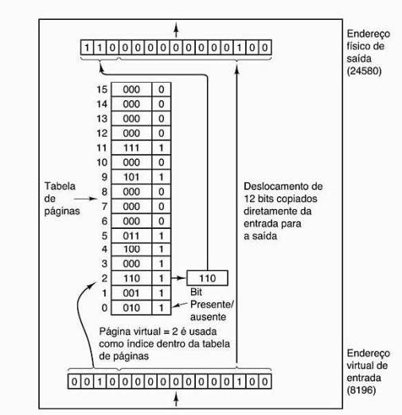

Exemplo: 
* Endereço 8196 (010000000000100)
* Tabela tem 16 entradas (0000 a 1111)
* Muda-se o número de página da página através da tabela e mantém o deslocamento

Tamanho das Páginas:
* Páginas maiores: leitura eficiente, tabela menor, fragmentação interna
* Páginas menores: leitura menos eficiente, tabela maior, menor fragmentação

### Tabela de Páginas

Mapeia uma página virtual em uma página real.

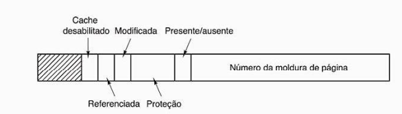

* Page frame number: identifica a página real (número)
* Bit de residência (presente/ausente)
    * 1 -> página é válida e está na RAM
    * 0 -> não está na RAM
* Bits de proteção
    * 0 -> leitura/escrita
    * 1 -> leitura
    * 2 -> execução
* Bit de modificação
    * 1 -> página alterada
    * 0 -> não alterada
* Bit de referência
    * 1 -> referenciada corretamente
    * 0 -> não referenciada corretamente
* Bit de cache: Permite desabilitar o caching da página (interessante saber quando e a razão da necessidade disso)

Onde a Tabela pode ser armazenada?

1. Array de registradores
2. Própria RAM
* Usa dois registradores:
    * Registrador de base da tabela de página
        * Aponta para o início da tabela, indicando o endereço físico de memória onde a tabela está alocada
    * Registrador de tamanho da tabela de página
        * Indica o tamanho da tabela de página
    * Problema: dois acessos para instrução/dados na RAM, um pra tabela e outro para o dado/instrução em si
* Solução: TLB (translation lookaside buffer)
    * Guarda ocorrências mais comumente utilizadas na tabela de página
    * Funcionamento: Através do número de página procura na própria TLB e depois reutiliza o deslocamento, caso contrário confere a tabela de páginas através do número de página e reutiliza o deslocamento

Falta de Página (Page Fault):
* Soft miss: página referenciada não está na TLB, mas está na RAM.
    * Solução: Atualizar TLB
* Hard miss: Página não está na memória física nem na TLB
    * Solução: Trazer disco à RAM e depois à TLB (Lento, mas fazer o que?)

### Como organizar a tabela de páginas?

#### Paginação Hierárquica (Multinível)

1. Quebrar o endereçamento em múltiplas tabelas de páginas - apenas a(s) tabelas mais importantes ficam na RAM 
2. O mais simples é quebrar em dois níveis  (mantendo a parte da tabela necessária)
3. Isso mantém menos espaço pro SO

Exemplo em máquina de 32 bits:
* Endereçamento lógico tem 3 partes:
    1. número de página PT1, com 10 bits, da ‘primeira tabela’ 
    2. número de página PT2, com 10 bits, da ‘segunda tabela’ 
    3. offset (deslocamento, tamanho) na RAM de fato 
* Isso garante que apenas guardar uma parcela das informações permite acessar toda a memória que o processo precisa, bastando caminhar nos vários níveis. 

#### Hash Table

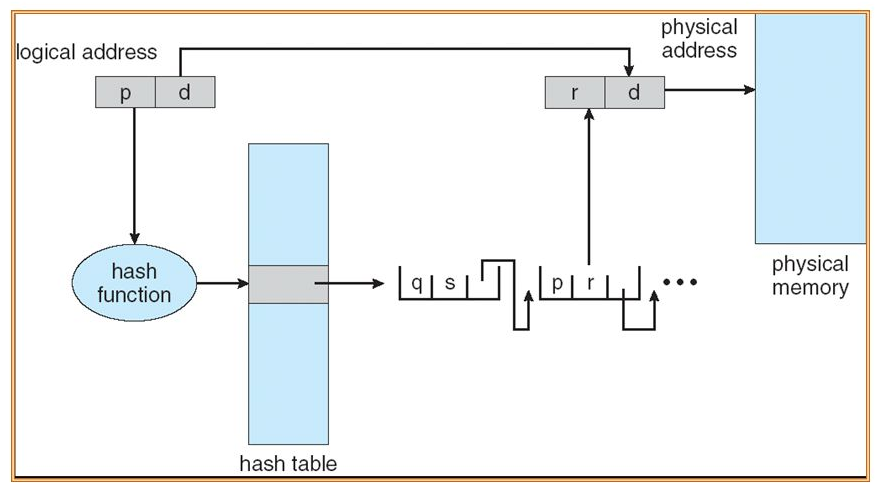

1. Guardar páginas em uma tabela hash
2. Resgatar endereçamento físico de páginas significa calcular o hash e buscar pelo correspondente na tabela

Desvantagem: resolve até 32 bits, mas 64 bits gera tabela muito grande.

#### Page Table Invertida

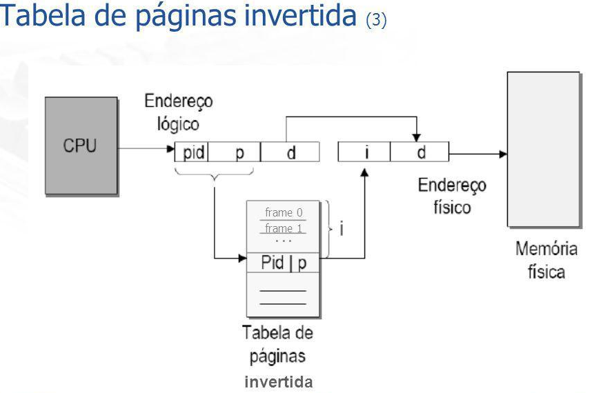

1. Uma entrada por frame na memória real, ou seja o mapeamento se dá pela memória física e não pela virtual.
2. Por exemplo, com os endereços virtuais de 64 bits, um tamanho de página de 4 KB e 4 GB de RAM, uma tabela de página invertida exige apenas 1.048.576 entradas. A entrada controla qual (processo, página virtual) está localizado na moldura da página.
3. A tabela de páginas possui apenas as ocorrências de páginas físicas, ou seja para carregar o processo p é necessário percorrer todas as páginas da tabela e com isso obter o endereçamento físico correto. Isso pode diminuir consideravelmente o espaço, principalmente quando o espaço de endereçamento virtual é muito maior que a memória física.
4. Para resolver este problema de buscar todos os processos na tabela, utiliza a TLB para guardar recuperar as ocorrências das páginas recentemente utilizadas. Caso a página procurada não esteja na TLB, procurar na tabela.

### Reposição de Página

Políticas de reposição:
* Local: Substitui a página do processo que está na tabela a mais tempo
* Global: Substitui a página dos processos que está na tabela a mais tempo

Motivação: Quando ocorre uma falta de página, o SO precisa escolher uma página a ser removida a fim de liberar espaço para uma nova página ser trazida à memória. Se a página a ser removida tiver sido modificada enquanto estava na memória, ela deverá ser reescrita no disco. Caso a página não tiver sido modificada, a cópia em disco já está atualizada então não será necessário reescrevê-la. Portanto é melhor que a página a ser descartada seja uma página que não esteja sendo usada, para evitar custos extras no caso de uma nova chamada dessa página, para isso existem os algoritmos de substituição que visam implementar essas trocas da melhor maneira possível.

#### Tratamento de Falta de Páginas

1. Quando tenta acessar a memória física, gera uma trap, que é repassada ao kernel
2. Registradores gerais são salvos
3. SO define qual página virtual é necessária
4. SO verifica a validade do endereço e busca o page frame
5. Se o bit de escrita (dirty bit) é 1, escreve a página no disco (é uma operação de IO).
6. SO traz a página necessária do disco
7. Tabela de Páginas é atualizada
    * Volta ao início da tentativa de acesso.
8. Falta de Página é gravada
9. Registradores gerais são restaurados
    * Programa continua

#### Algoritmos:

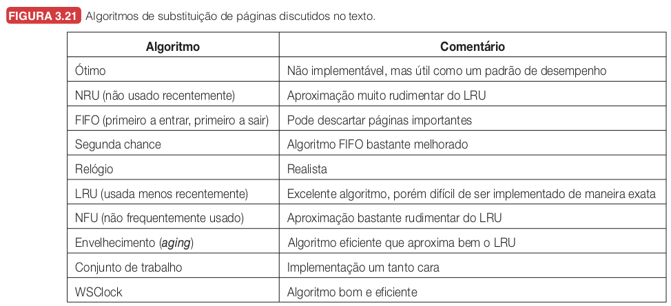

* FIFO (First In First Out): A mais simples das políticas, mas com pior desempenho. A primeira página que foi alocada à memória será a primeira a sair quando precisar haver uma reposição.
* Second-chance: Essa política funciona de maneira muito parecida com o FIFO, mas seu diferencial é que para cada página em memória há um bit que especifica se ela foi recentemente acessada. A página desalocada é sempre a que se encontra na cabeça da fila e que possui o bit de acesso indicando “falso”. Caso a página da cabeça da fila possua o bit indicando “positivo”, então o bit passará a indicar “falso” e a página será lançada para o final da fila. Isso é repetido até que alguma página possa ser desalocada.
* NRU (Not Recently Used): O NRU é um dos algoritmos mais eficientes, e sua ideia é manter um breve histórico de como a página foi utilizada. Assim, para manter esse histórico, para cada página o NRU configura dois bits, um de referenciamento e um de escrita. Quando a página é adicionada ou acessada, ela já insere o tipo de acesso que foi feito, de leitura ou escrita, e por ter sido usada, ela é uma página referenciada. De certo em certo tempo, todas as páginas que estão na memória perdem seu referenciamento, mas não seu bit de escrita. Quando a memória está cheia, o NRU checa os bits de escrita e referenciamento, WR, e tenta remover na seguinte ordem: 00, 01, 10, 11, apenas passando para a próxima categoria quando a anterior estiver vazia. Assim, o NRU consegue avaliar muito bem as páginas que foram usadas recentemente e qual o peso de removê-las da memória.
* LRU (Least Recently Used): O LRU é um algoritmo que tenta manter na memória as páginas utilizadas mais recentemente, e age de forma um pouco similar ao FIFO: quando a página é inserida, ela fica no final de uma fila; caso seja acessada, volta para o fim da fila. A ideia de manter essa fila é que, quando a página atinja o início da fila, ela possa ser removida, já que não foi acessada recentemente.
* Aging: Assim como o NRU, o Aging tenta manter um histórico dos acessos às páginas, mas sua estratégia não considera o tipo de acesso, se foi leitura ou escrita, mas sim quando foi acessado. Dessa forma, o Aging pode ser implementado com um número N de bits para cada página, ou seja, mantém um histórico de N execuções da função de clock. Quando uma página é inserida ou acessada, seu bit mais significativo é setado para 1, enquanto os outros permanecem em 0. Após um certo número de clocks, um shift à direita é executado nos bits de todas as páginas. Quando a memória está cheia, o Aging remove a página cujo valor binário é o menor.
* Belady (Ótimo): Essa política tem o “poder” de enxergar o futuro, prevendo qual das páginas alocadas é a que será usada em um futuro mais distante. Essa página então é desalocada para dar espaço à nova página. Por conta disso essa é a reposição com melhor desempenho, pois é a que melhor evita o acontecimento de page faults. Por outro lado ela não pode ser implementada no mundo real, já que não se é possível prever o futuro de forma tão exata.

### Segmentação

Blocos chamados de segmentos. Como sabemos os processos são formados por código, dados e pilha, e cada um desses será um segmento, ou seja, um bloco diferente. Não havendo a mistura, como pode ter na paginação. Vantagens: Facilita proteção dos dados (permissões de leitura, escrita etc), facilita compartilhamento de procedimentos e dados entre processos.

Porque uma linguagem de programação não deixa criar arrays sem tamanho predefinidos? Seria muito custoso colocar nas linguagens, alterar, apesar da memória ser segmentada.

Muitos SO’s usam a mistura dessas duas técnicas, ou seja, os blocos serão páginados. 
