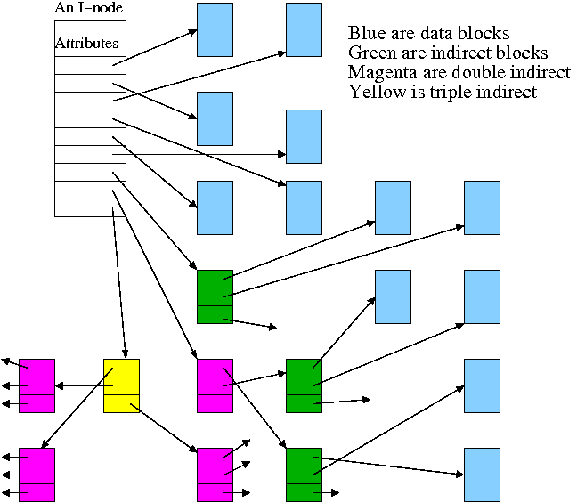
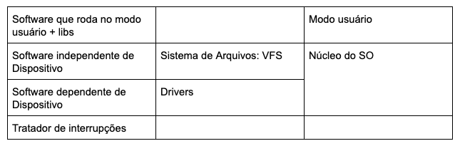
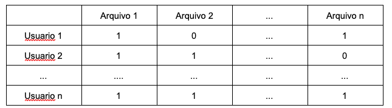
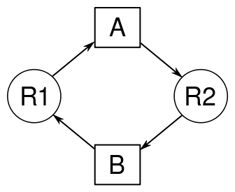

# Terceiro Estágio

## Sistemas de Arquivos

O disco do Computador é organizado em diversas partições, onde cada uma delas tem uma função determinada. Além disso, algumas partições do disco fazem parte de um super bloco, isto é, uma região de partições alocada a um determinado fim. A primeira das partições tem uso dedicado ao boot, a segunda ao / e sistemas de arquivo, e assim por diante, havendo partições para dados, endereços, listas de links, etc.

Uma partição é formada por um conjunto de *n* i-nodes, e um i-node é composto por seus atributos, 10 linhas de dados, 1 linha para o primeiro nível de indireção, 1 linha para o 2º nível de indireção, e 1 linha para o 3º nível de indireção. Os níveis de indireção são utilizados em arquivos grandes, que não cabem apenas em um i-node, e por isso um i-node guarda apenas parte daquela informação, apontando em seguida para outro i-node com mais informação, e assim por diante.

No sistema de arquivos, um diretório possui **apenas** a referência para o nome e o i-node onde os seus diretórios filhos se encontram. Por exemplo, se os diretórios C e D estiverem contidos no diretório B, o diretório B possui uma espécie de tabela, indicando que para acessar o diretório C ele deve ir ao i-node de número x, e para acessar o diretório D, ele deve ir ao i-node de número y. Como cada partição tem um tamanho fixo de i-nodes, a partir do número do i-node encontra-se a partição onde ele está inserido.

 ## Princípios de IO

 ### Buffers de IO

 Para realizar leitura do disco e de outros sistemas de entrada e saída, utiliza-se uma coleção de buffers. Esses buffers são divididos em duas partes principais: o cabeçalho, onde se tem o device e o número do bloco de onde se está lendo, e o body, onde armazena-se a informação até o momento; é no cabeçalho onde se aplica a função de hash. Quando um buffer está alocado para uma leitura nos dispositivos, ele fica impossibilitado de ser utilizado para outra leitura; ao fim da leitura, o hardware indica o fim da operação através de uma interrupção.

A função de hash nos cabeçalhos serve também para caching das informações já que, se o arquivo foi lido recentemente, não será necessário que seja lido novamente, por já haver um buffer com a informação. Quando todos os buffers estão cheios e se tenta realizar uma nova operação com uma hash que ainda não está num buffer, o buffer que foi utilizado menos recentemente é desalocado e realocado para a nova operação.

Para cada processo, o sistema operacional mantém uma tabela de arquivos abertos, que tem seu tamanho máximo determinado pelo SO, e guarda nas três primeiras posições da tabela os endereços (i-node) de entrada padrão, saída padrão, e saída padrão quando acontece erro. Caso o usuário queira mudar a entrada ou a saída, o SO permite a alteração, a exemplo de: `cat arquivo.txt` e `cat arquivo.txt > copia_arquivo.txt`.

Entretanto, há um problema quando múltiplos processos tentam acessar o mesmo arquivo: como saber exatamente onde o cursor deve escrever no arquivo, já que cada processo aberto possui um cursor diferente para o arquivo? A solução para este problema é simples: cada processo possui uma tabela de arquivos abertos, mas o SO também possui uma tabela de arquivos abertos, e ao invés do cursor de cada processo apontar diretamente para o i-node onde o arquivo está, ele aponta para o cursor do SO, e o cursor do SO aponta para o i-node. Assim, quando um processo modifica o arquivo, os outros processos que tentarem acessá-lo irão ter sua referência atualizada automaticamente, já que sua referência não é à posição do i-node, e sim ao cursor do SO.

### Camadas de Entrada e Saída

Supondo que um processo esteja executando por um usuário e, num dado momento, o processo faça uma leitura ao disco do computador, à exemplo do código em Python `open(‘arquivo.txt’, ‘r’)`, como esse código é executado?

Inicialmente o processo, que está rodando no modo Usuário, precisa entender o que foi feito naquela linha de código, e para isso faz uso das libs, isto é, código já implementado na linguagem que se está usando (Python, no caso). O código das libs, em seguida, faz uma **syscall**, requisitando ao SO acesso ao arquivo. O SO, visto ainda como uma caixa preta, faz acesso ao disco e recupera o arquivo, repassando-o ao processo.

Entretanto, ao olhar mais detalhadamente à esse processo e tentando entender quais os passos que o SO faz para recuperar esse arquivo, temos que o SO tem uma camada que é independente do dispositivo que está utilizando, e é a camada que se comunica com a camada dependente do dispositivo e que sabe realizar as operações mais adequadamente a depender dele. Essa camada dependente do dispositivo também se comunica com uma camada de tratamento de interrupções.

Assim, podemos entender que:
1. O processo faz uso de código da lib
2. A lib faz uma syscall
3. Por ter havido a syscall, o SO faz uso de software dependente de driver
4. Esse software dependente usa um buffer de IO para acessar o disco
5. Após a leitura, o disco interrompe a cpu
6. A interrupção é levada ao tratador de interrupções, que move o estado do processo de BLOQUEADO para PRONTO.
7. Quando o escalonador escolher o processo seus dados estarão num buffer, e então o SO repassa a lib, que repassa ao código do processo.

No geral, o software da camada de entrada e saída pode ser visto da seguinte forma:

## Acesso aos arquivos

A forma mais simples de implementar um acesso aos arquivos é através de uma tabela:

Entretanto, essa forma de acesso é bastante precária, principalmente por ocupar uma quantidade absurda de memória. Assim, são propostas duas formas de acesso: Access Control List (ACL) e Capabilities. Ambas as formas são amplamente utilizadas, e a ACL é o sistema de acesso aos arquivos utilizado no UNIX.

### ACL

O access control list mantém três categorias de acesso ao arquivo, e a partir delas que ele gerencia o acesso e as permissões ao arquivo, que se dividem em leitura, escrita e execução (rwx, read, write and execute): a primeira categoria é exclusiva a um único usuário, o usuário que criou o arquivo, isto é, seu dono; a segunda categoria define um grupo de usuários; a terceira categoria são quaisquer usuários não presentes nas anteriores (outros).
Assim, para cada arquivo, há uma espécie de tabela com as permissões para cada grupo, mantida em string e que pode ser verificada com o comando `ls -l`: `drwx------`, por exemplo. O primeiro caractere da string será discutido posteriormente.

### Capabilities

Nas capabilities, o acesso aos arquivos é feito com princípios na criptografia, através de chaves de acesso. Nas capabilities, há duas formas mais gerais de criptografia:

#### Criptografia de Chave Simétrica

A criptografia de chave simétrica é uma função na qual uma única chave é necessária para criptografar e descriptografar o arquivo: f(chave, arq) = arq'; f(chave, arq') = arq. É bastante rápida e simples, entretanto, uma vez que se obtém a chave, se possui acesso completo ao arquivo e, assim, não pode ser considerada tão segura.

#### Criptografia de Chave Assimétrica

A criptografia de chave assimétrica consiste no uso de duas chaves: uma pública, na qual todos os usuários têm acesso às chaves dos outros, e uma privada, na qual apenas o seu dono tem acesso. É chamado de chave assimétrica pois seu funcionamento consiste na seguinte forma: aquilo que foi criptografado com a chave privada só pode ser descriptografado com a chave pública, e aquilo que foi criptografado com a chave pública só pode ser descriptografado com a chave privada. Cada usuário possui seu par de chaves pública e privada.

Entretanto, criptografar algo pela forma assimétrica é caro. Para resolver esse problema, costuma-se criptografar o arquivo utilizando a criptografia de chave simétrica, por ser eficiente. Como o arquivo criptografado só pode ser acessado com a chave, e em seguida utiliza-se a criptografia assimétrica para compartilhar a chave: quando um usuário u1 quer enviar a chave para outro usuário u2, ele pega a chave pública de u2e criptografa o arquivo: como apenas u2possui acesso à sua chave privada, só ele pode descriptografar a chave simétrica do arquivo e utilizá-la.

### Autenticidade

Para conferir a autenticidade do arquivo, existem diversas formas. Uma delas é pelo envio de uma hash (SHA-256, SHA-512), que deve ser comparado com o resultado de uma função: caso a hash e o resultado da função sejam idênticos, o arquivo é autêntico.

### Recuperação de Arquivos

Para garantir a confiabilidade, utiliza-se o RAID (Redundant Array of Inexpensive Disks), checksum ou Políticas de Backup.

#### File System Check (fsck)

Quando há uma queda de energia ou algo que desliga o computador abruptamente, existiam arquivos sendo lidos e escritos, e que podiam estar no buffer de IO. Como no shutdown do computador essas modificações foram perdidas, o sistema precisa de uma política de verificação de arquivos, de forma que os arquivos não fiquem inconsistentes. No UNIX, essa política é implementada pelo fsck.

Para cada um dos blocos do disco, existe uma tabela indicando se aquele bloco estava livre ou ocupado, isto é, para cada arquivo existe uma tupla (O, L). Apesar do valor ser binário (ou está ocupado ou está livre), a tupla garante maior confiabilidade ao sistema, e é a partir dela que a integridade dos arquivos é verificada.

Como segundo passo da verificação, é necessário olhar o número de ligações que cada i-node possui. Se o número de ligações for maior que 0, o i-node é útil e deve ser verificado. Quando o boot acontece e o fsck roda, se faz uma contagem de referências, a partir do /, para verificar quantas referências à cada diretório e arquivo existem. Então, essa contagem é comparada com o valor armazenado em cada i-node, pois esses números devem ser iguais num sistema consistente.

### Virtual File System (VFS)

O sistema de arquivos virtual é um complemento ao sistema de acesso à arquivos (ACL/Capabilities). No caso, quando consideramos o caso de ACL, temos um detalhe importante: ao executarmos ls -l no UNIX, foi visto que se tinha uma string com 10 caracteres do tipo `drwx------`. Os 9 últimos caracteres dessa string se referem ao ACL, mas o primeiro caractere se refere ao tipo do arquivo, que pode ser um entre d (diretório), c (buffer à caractere), b (bloco, endereçável), l (link), entre outros.

Em termos básicos, o VFS serve como uma interface entre o software que o usuário executa, o sistema de arquivos e a camada de software dependente de dispositivo.

## Drivers

### Driver de Disco

TBD

### Driver de Terminal

TBD

### Driver de Teclado

#### Raw vs Cooked

* Modo cru (raw):
    * Driver entrega diretamente cada caractere ao processo (incl. teclas ctrl, alt, f1-f10, alt, shift, ...)
    * Sem modificações, sem eco (mostrar o caractere digitado)
* Modo processado (cooked):
    * Caracteres são armazenados em buffer até que uma linha toda tenha sido acumulada
    * Driver faz o processamento de caracteres especiais no buffer, e ecoa o resultado na tela
    * Driver precisa:
        * Bufferizar uma linha inteira antes de passa-la para o processo
        * Processar caracteres de controle especiais(Ctrl-C, ERASE, Del, line-erase, Tab, shift)
        * Ecoar o caracter digitado
        * Nova linha pode ser processada em paralelo com o processamento de linha anterior 

#### Buffer de Teclado

TBD

### Driver de Relógio

#### Fatia de Tempo

TBD

#### Syscall Sleep

TBD

#### Manter Data e Hora do Sistema

TBD

#### Time

TBD

#### Contabilidade de Uso da CPU

TBD

#### Profiler

TBD

#### Alarme

TBD

## Deadlocks

Deadlock refere-se a uma situação em que ocorre um impasse, que dois ou mais processos ficam impedidos de continuar suas execuções, ou seja, ficam bloqueados esperando por um evento que só pode ocorrer quando um dos processos envolvidos for executado.

Condições **necessárias e suficientes** para que haja um deadlock:

* Não preempção: uma vez que um recurso é alocado, ele tem que ser liberado voluntariamente pelo processo
* Posse e espera: um processo pode estar de posse de um recurso e à espera de um outro recurso
* Exclusão mútua: um recurso é alocado para apenas um processo por vez
* Espera circular: há um ciclo de processos em espera

Prevenir vs. Evitar:
* Prevenir: impossibilitar que algo aconteça
* Evitar: tomar precauções para que algo não aconteça

Como tratar Deadlocks?

Abaixo, leia-se *atacando* como "tentando evitar que tal condição da ocorrência de deadlock ocorra".

1. Detectar e recuperar
    * Detecção: Constrói-se um grafo de recursos e processos e verifica-se se o grafo possui um ciclo
    * Recuperação: 
        1. Faz-se a preempção de um dos recursos para liberar seu uso para outro processo
        2. Forma mais fácil: Matar o processo envolvido no deadlock (tomar cuidado porque não serve para qualquer processo e depende do processo e do sistema, porque o processo pode voltar)
2. Evitar que ele ocorra
    1. Antes de alocar recurso a processo, verificar se essa alocação geraria um deadlock. O problema é que poderia ser gerado um deadlock nesse processo
    1. Algoritmo mais famoso: algoritmo do banqueiro
        * Ideia: alocar recursos para processos que irão devolver os recursos
        * Tem-se a matriz de demanda (R x P, detalhando quais recursos cada processo demanda), listas que detalham a oferta e a disponibilidade dos recursos, e gera-se uma matriz de alocação. Inicialmente cria-se essa matriz com todos valores em 0 e verifica-se a disponibilidade e a demanda para determinar se é possível alocar um recurso ao processo.
        * Problema: essa estratégia caiu em desusos, pois não é possível definir a priori as demandas de recursos pelos processos e as ofertas dos recursos
3. Prevenir que ele ocorra 
    * Atacando na posse e espera (não promissor)
        1. Impedir que o processo esteja com mais de um recurso simultaneamente
        1. Antes de obter um novo recurso, liberam-se todos os recursos atuais e recuperam-se todos, incluindo o novo
    * Atacando na exclusão mútua (mais ou menos promissor)
        1. Cria-se uma abstração (fila) que transforma um recurso dedicado em recurso compartilhado
        1. Não é possível fazer isso para qualquer recurso
    * Atacando na espera circular (mais ou menos promissor)
        1. Atribui-se a cada recurso um identificador, que serve para determinar se um recurso pode ser ou não alocado a um certo processo
        1. Aumenta muito a complexidade do sistema
    * SO não pode se responsabilizar para prevenção de deadlocks, os programadores que precisam resolver isso nas aplicações desenvolvidas

